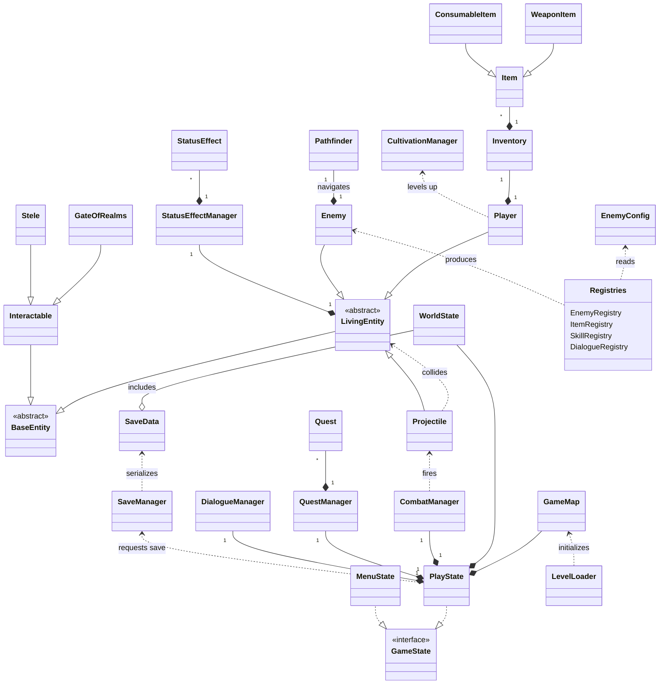

# CP2 - Objektový návrh (DaoEngine)

Tento dokument slouží jako odevzdání k druhému kontrolnímu bodu (CP2) předmětu. Definuje kostru kódu, závislosti mezi entitami a popisuje architektonické vzory a komplexní interakce použité v projektu DaoEngine.

## 1. Zvolené technologie a knihovny
- **Jazyk:** Java (JDK 21+)
- **UI a Vykreslování:** JavaFX (`javafx.scene.canvas.GraphicsContext`)
- **Manipulace s daty:** Jackson (`com.fasterxml.jackson`) pro serializaci konfigurací a herního stavu do formátu JSON.
- **Testování:** JUnit 5 a PITest (Mutační testy).

## 2. Popis stavů aplikace (State Machine)
Hra je řízena pomocí návrhového vzoru **State**. Centrem je rozhraní `GameState`, od kterého se odvíjejí konkrétní stavy.

- **`MenuState`**: Úvodní obrazovka, start nové a načtení staré hry. Po stisku tlačítka "Start" dochází k instanciaci `PlayState`.
- **`PlayState`**: Hlavní herní smyčka. Zastřešuje dílčí stavy hry, definované výčtem `PlayMode` (PLAYING, VICTORY, GAMEOVER).
- **`PauseMenuState`**: Herní menu pro ukládání a načítání pozic (vyvolané klávesou ESC).
- **`LexiconState`**: Databáze znalostí o nepřátelích a předmětech.

## 3. Detailní hierarchie a interakce entit

### 3.1 Entitní systém (Inheritance & Composition)
Engine využívá hlubokou dědičnost pro sdílení dat a kompozici pro funkční chování:
1. **`BaseEntity`** (abstraktní): Každý objekt v prostoru mapy (`x`, `y`, `size`).
2. **`LivingEntity`** (abstraktní): Přidává bojové staty (`hp`, `maxHp`, `speed`).
    - **Vazba**: `LivingEntity` vlastní **`StatusEffectManager`**, který spravuje kolekci `StatusEffect` objektů (modulární buffy/debuffery).
3. **`Player`**: Rozšiřuje `LivingEntity`. Vlastní **`Inventory`** a spravuje `qi` úrovně.
4. **`Enemy`**: Rozšiřuje `LivingEntity`. Má `damage` atribut a využívá **`Pathfinder`** pro navigaci.
5. **`Interactable`**: Neživé objekty (`Stele`, `GateOfRealms`), se kterými lze interagovat přes metodu `onInteract()`.

### 3.2 Systém předmětů a inventáře
- **`Inventory`**: Třída spravující pole `Item` objektů. Rozlišuje mezi `mainInventory` a `hotbar`.
- **`Item`** (abstraktní): Základ pro všechny předměty (`WeaponItem`, `ConsumableItem`, `MaterialItem`).
- **Polymorfismus**: Každý potomek přetěžuje metodu `use(Player)`, což umožňuje unikátní chování (léčení, útok, crafting).

## 4. Architektonické vzory a datové toky

### 4.1 Registry Pattern & Data-Driven Design
Naprosto klíčový vzor pro oddělení kódu od dat. Registry (`EnemyRegistry`, `ItemRegistry`, `SkillRegistry`) slouží jako továrny (Factory), které:
1. Načtou JSON soubor pomocí Jackson mapperu.
2. Deserializují data do konfiguračních tříd (např. `EnemyConfig`).
3. Při požadavku na novou instanci ("bat_01") vytvoří objekt `Enemy` a nastaví mu atributy z konfigurace.

### 4.2 Centralizovaní Manažeři (Controller Layer)
- **`CombatManager`**: Centralizuje bojovou logiku. Vytváří a aktualizuje **`Projectile`** objekty. Kontroluje kolize s `LivingEntity` a aplikuje poškození.
- **`WorldState`** (Singleton): Globální úložiště příběhového postupu. Umožňuje přenášet stav (např. "quest1_done") mezi levely.
- **`QuestManager`**: Sleduje události v enginu a aktualizuje stav aktivních `Quest` objektů.

## 5. Komplexní Diagram tříd (Mermaid)

## 6. Provozní poznámky
Tato architektura byla navržena tak, aby minimalizovala závislosti mezi jednotlivými moduly (decoupling). Díky vzoru Singleton a centralizovaným registrům je engine vysoce perzistentní a snadno rozšiřitelný o nový obsah bez nutnosti zásahu do jádra kódu. Systém podporuje plně asynchronní operace u zvuků a vizuálních efektů.
