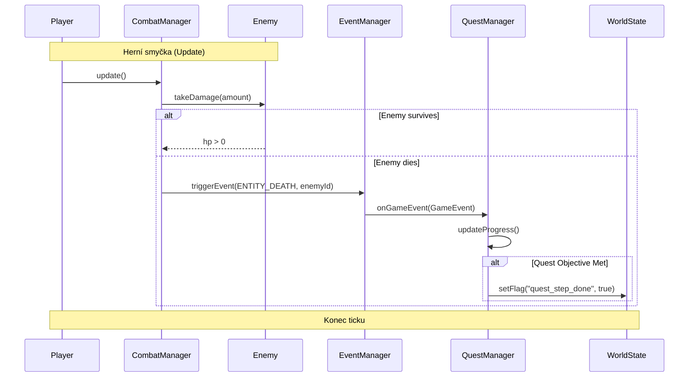
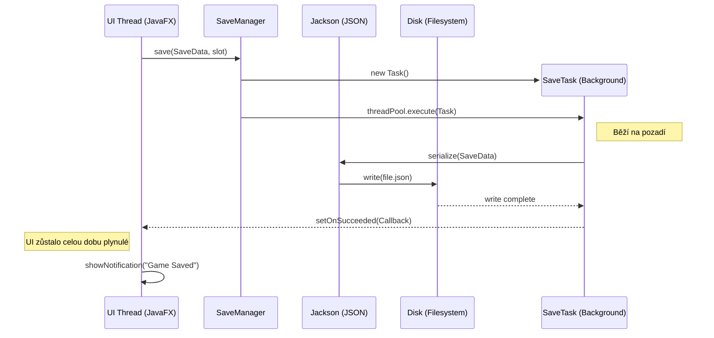

# Technická dokumentace: DaoEngine - Path to Immortality

Tento dokument slouží jako komplexní technický průvodce herním enginem **DaoEngine**. Dokumentace podrobně popisuje softwarovou architekturu, implementační detaily klíčových subsystémů a splnění všech požadavků stanovených zadáním semestrální práce.

---

## 1. Architektonický přehled a technologie

### 1.1 Technologický zásobník (Tech Stack)
Projekt je navržen s důrazem na modularitu, výkon a snadnou rozšiřitelnost. Využívá moderní Java technologie:

- **Java 21+**: Využití moderních prvků jazyka jako jsou `switch expressions`, `sealed classes` (pro stavy) a vylepšená práce s kolekcemi.
- **Maven**: Nástroj pro správu životního cyklu projektu, závislostí a automatizaci sestavení.
- **JavaFX 21**: Hlavní framework pro grafické uživatelské rozhraní. Engine sází na **Direct Canvas Rendering** (přímé vykreslování na plátno).
- **Jackson Databind (JSON)**: Klíčová knihovna pro serializaci dat.
- **SLF4J & Logback**: Profesionální logovací systém.
- **JUnit 5 & Mockito**: Standard pro automatizované testování.

---

## 2. Komplexní diagram tříd (Mermaid)

Následující diagram znázorňuje kompletní architekturu DaoEngine a ukazuje vztahy mezi všemi hlavními třídami a subsystémy v anglickém originále pro zachování technické přesnosti.

```mermaid
classDiagram
    direction BT

    %% --- CORE & INFRASTRUCTURE ---
    subgraph Core_and_Infrastructure
        class DaoEngineApp {
            +start(Stage stage)
            -update(double dt)
            -render(GraphicsContext gc)
        }
        class Main { +main(String[] args) }
        class AssetRegistry { <<Singleton>> }
        class ConfigManager { <<Singleton>> }
        class GameConfig { <<POJO>> }
        class GameLogger { <<Static>> }
        class Input { <<Static>> }
        class SaveManager { <<Static>> }
        class SaveData { <<POJO>> }

        DaoEngineApp ..> AssetRegistry : initializes
        DaoEngineApp ..> ConfigManager : uses
        ConfigManager ..> GameConfig : loads
        SaveManager ..> SaveData : serializes
    end

    %% --- STATE MACHINE ---
    subgraph State_Management
        class GameState { <<interface>> }
        class MenuState
        class PlayState
        class PauseState
        class LoadState
        class LexiconState
        class LoadingState
        class GameOverState

        GameState <|.. MenuState
        GameState <|.. PlayState
        GameState <|.. PauseState
        GameState <|.. LoadState
        GameState <|.. LexiconState
        GameState <|.. LoadingState
        GameState <|.. GameOverState
        DaoEngineApp "1" *-- "1" GameState : current
    end

    %% --- ENTITY SYSTEM ---
    subgraph Entity_System
        class BaseEntity { <<abstract>> }
        class LivingEntity { <<abstract>> }
        class Player
        class Enemy
        class Projectile
        class WorldItem
        class InteractableEntity
        class GateOfRealms
        class LightningStrike
        class EnemyRegistry { <<Factory>> }
        class EnemyConfig

        BaseEntity <|-- LivingEntity
        LivingEntity <|-- Player
        LivingEntity <|-- Enemy
        BaseEntity <|-- Projectile
        BaseEntity <|-- WorldItem
        BaseEntity <|-- InteractableEntity
        InteractableEntity <|-- GateOfRealms
        Projectile <|-- LightningStrike

        EnemyRegistry ..> EnemyConfig : reads
        EnemyRegistry ..> Enemy : produces
    end

    %% --- LEVEL & WORLD ---
    subgraph World_Architecture
        class Level
        class LevelConfig
        class LevelLoader
        class GameMap
        class MapGenerator
        class Pathfinder
        class Biome { <<enumeration>> }
        class InteractableConfig

        PlayState "1" *-- "1" Level
        Level "1" *-- "1" GameMap
        Level "1" *-- "1" MapGenerator
        LevelLoader ..> Level : creates
        GameMap "1" *-- "1" Pathfinder
        MapGenerator ..> Biome : uses
        LevelLoader ..> LevelConfig : reads
    end

    %% --- RPG & LOGIC ---
    subgraph Game_Logic
        class CombatManager
        class QuestManager
        class Quest
        class CultivationManager
        class CultivationRank { <<enum>> }
        class AttributeSet
        class BuffManager
        class StatusEffectManager
        class StatusEffect { <<abstract>> }
        class TribulationTimer
        class WorldState { <<Singleton>> }
        class ParticleManager
        class SoundManager

        PlayState "1" *-- "1" CombatManager
        PlayState "1" *-- "1" QuestManager
        PlayState "1" *-- "1" CultivationManager
        PlayState "1" *-- "1" TribulationTimer
        PlayState "1" *-- "1" WorldState
        
        LivingEntity "1" *-- "1" AttributeSet
        LivingEntity "1" *-- "1" BuffManager
        LivingEntity "1" *-- "1" StatusEffectManager
        StatusEffectManager "1" *-- "*" StatusEffect
        CultivationManager ..> CultivationRank : manages
        QuestManager "1" *-- "*" Quest
    end

    %% --- ITEM SYSTEM ---
    subgraph Item_Management
        class Item { <<abstract>> }
        class Inventory
        class ItemRegistry { <<Factory>> }
        class WeaponItem
        class ConsumableItem
        class MaterialItem
        class SkillBookItem
        class ItemConfig
        class WeaponConfig
        class RecipeConfig

        Player "1" *-- "1" Inventory
        Inventory "1" *-- "*" Item
        Item <|-- WeaponItem
        Item <|-- ConsumableItem
        Item <|-- MaterialItem
        Item <|-- SkillBookItem
        ItemRegistry ..> ItemConfig : reads
        ItemRegistry ..> Item : produces
    end

    %% --- EVENT SYSTEM ---
    subgraph Event_Driven_Core
        class EventManager { <<Mediator>> }
        class GameEvent
        class GameEventListener { <<interface>> }

        EventManager ..> GameEvent : dispatches
        QuestManager ..|> GameEventListener : implements
        CombatManager ..> EventManager : notifies
    end

    %% --- UI & RENDERING ---
    subgraph UI_and_Visuals
        class WorldRenderer
        class PlayUIManager
        class DialogManager
        class DialogueRegistry
        class DialogueNode

        PlayState "1" *-- "1" WorldRenderer
        PlayState "1" *-- "1" PlayUIManager
        PlayUIManager "1" *-- "1" DialogManager
        DialogManager ..> DialogueRegistry : fetches
        DialogueRegistry ..> DialogueNode : contains
    end

    %% --- CROSS-SYSTEM CONNECTIONS ---
    CombatManager ..> LivingEntity : damage
    Pathfinder ..> GameMap : navigation
    SaveManager ..> PlayState : snapshots
    Quest ..> GameEvent : trigger conditions
    Level ..> WorldItem : spawns
```



### 2.2 Sekvenční diagram: Průběh souboje a aktualizace úkolu
Tento diagram znázorňuje dynamickou interakci mezi systémy při zabití nepřítele, což vede k aktualizaci hráčova úkolu.



### 2.3 Sekvenční diagram: Asynchronní ukládání hry (Multithreading)
Tento diagram ukazuje, jak engine využívá JavaFX `Task` k uložení hry na pozadí, aniž by došlo k zamrznutí uživatelského rozhraní.



### 2.4 Struktura souborů projektu
Přehled fyzického uspořádání zdrojových kódů a herních dat v adresářové struktuře Maven projektu.

```text
DaoEngine/
├── src/
│   ├── main/
│   │   ├── java/org/example/
│   │   │   ├── entity/         # Entity (Player, Enemy, Projectile)
│   │   │   ├── item/           # Předměty a inventář
│   │   │   ├── level/          # Mapy, generátor a pathfinding
│   │   │   ├── logic/          # Jádro logiky (Combat, Quest, Sound)
│   │   │   │   └── event/      # Event-driven systém
│   │   │   ├── render/         # Vykreslování (WorldRenderer)
│   │   │   ├── state/          # Stavový automat (PlayState, MenuState)
│   │   │   └── ui/             # GUI manažeři
│   │   └── resources/
│   │       ├── enemies/        # Konfigurace nepřátel (JSON)
│   │       ├── items/          # Definice předmětů a receptů
│   │       ├── levels/         # Data levelů, questů a dovedností
│   │       ├── sounds/         # Zvukové soubory (mp3)
│   │       └── textures/       # Grafické podklady (png)
│   └── test/java/org/example/  # Unit a integrační testy
├── saves/                      # Adresář pro uložené pozice
└── pom.xml                     # Maven konfigurace
```

### 2.4 Architektonická rozhodnutí (Design Rationale)

V této sekci jsou popsána klíčová rozhodnutí, která ovlivnila výslednou podobu enginu.

#### 2.4.1 Direct Canvas vs. Scene Graph
**Rozhodnutí**: Engine využívá `GraphicsContext` JavaFX Canvasu pro veškerý in-game rendering místo standardního Scene Graphu (tlačítek a panelů jako uzlů v grafu scény).
- **Důvod**: Scene Graph je náročný na paměť při velkém počtu objektů. Direct Canvas nám umožňuje vykreslovat tisíce dlaždic a částic bez režie spojené se správou tisíců Java objektů v paměti scény.
- **Důsledek**: Vyšší výkon a plynulejší animace ("Silk & Ink" styl).

#### 2.4.2 Data-Driven Design skrze Registry
**Rozhodnutí**: Veškerý herní obsah (statistiky nepřátel, parametry zbraní, texty questů) je definován v externích JSON souborech.
- **Důvod**: Oddělení dat od logiky (decoupling). Umožňuje měnit balance hry (např. sílu zbraně) bez nutnosti rekompilace celého projektu.
- **Důsledek**: Engine je snadno modifikovatelný i pro ne-programátory.

#### 4.2.3 Event-Driven Logic (Mediator Pattern)
**Rozhodnutí**: Komunikace mezi nezávislými systémy (např. Combat a Quest) probíhá výhradně skrze `EventManager`.
- **Důvod**: Snížení provázanosti (coupling). `CombatManager` nemusí vědět o existenci `QuestManageru`. Pouze ohlásí událost "zabití nepřítele" a kdo má zájem, ten na ni zareaguje.
- **Důsledek**: Kód je čistší, lépe testovatelný a snadněji rozšiřitelný.

#### 2.4.4 Multithreadingová strategie
**Rozhodnutí**: Pro I/O operace jsou využity JavaFX `Task` objekty, zatímco pro časově kritické události `ScheduledExecutorService`.
- **Důvod**: JavaFX UI vlákno nesmí být nikdy blokováno. Operace se soubory (uložení hry) běží na pozadí, zatímco časovač Tribulace běží v daemon vlákně pro zajištění přesnosti nezávisle na renderování.
- **Důsledek**: Stabilní a responsivní aplikace bez "zasekávání".

---

## 3. Detailní Katalog všech 75 tříd projektu

Zde je uveden kompletní výčet všech tříd projektu s jejich detailním popisem.

### 3.01 Třída `DaoEngineApp`
- **Popis**: Hlavní třída aplikace orchestrující herní smyčku.
- **Odpovědnost**: Inicializace okna a správa stavů.
- **Klíčové metody**: `start`, `update`, `render`.
- **Poznámka**: Splňuje požadavek na orchestraci JavaFX.

### 3.02 Třída `AssetRegistry`
- **Popis**: Singleton pro správu grafických prostředků.
- **Odpovědnost**: Načítání a cachování Image objektů a výřezů ze spritů.
- **Klíčové metody**: `getSprite`, `loadAssets`.
- **Poznámka**: Optimalizuje využití paměti.

### 3.03 Třída `ConfigManager`
- **Popis**: Manažer pro načítání JSON konfigurací.
- **Odpovědnost**: Převod JSON souborů na Java objekty.
- **Klíčové metody**: `saveConfig`, `getConfig`.
- **Poznámka**: Klíčový pro Data-Driven design.

### 3.04 Třída `GameLogger`
- **Popis**: Wrapper pro logování v projektu.
- **Odpovědnost**: Výpis informací do konzole a souboru.
- **Klíčové metody**: `info`, `warning`, `error`.
- **Poznámka**: Konfigurovatelný za běhu.

### 3.05 Třída `SaveManager`
- **Popis**: Správce ukládání a načítání herních pozic.
- **Odpovědnost**: Práce se souborovým systémem.
- **Klíčové metody**: `save`, `load`.
- **Poznámka**: Využívá asynchronní Tasky.

### 3.06 Třída `Input`
- **Popis**: Manažer pro zpracování vstupů od uživatele.
- **Odpovědnost**: Sledování stavu kláves.
- **Klíčové metody**: `isKeyPressed`, `isLmbPressed`.
- **Poznámka**: Integrováno s JavaFX eventy.

### 3.07 Třída `BaseEntity`
- **Popis**: Abstraktní základ pro všechny herní objekty.
- **Odpovědnost**: Pozice, velikost a kolizní box.
- **Klíčové metody**: `render`.
- **Poznámka**: Základní stavební kámen světa.

### 3.08 Třída `LivingEntity`
- **Popis**: Entita s vlastnostmi živého organismu.
- **Odpovědnost**: HP, Qi a status efekty.
- **Klíčové metody**: `takeDamage`, `heal`.
- **Poznámka**: Základ pro Player a Enemy.

### 3.09 Třída `Player`
- **Popis**: Specifická implementace postavy hráče.
- **Odpovědnost**: Ovládání, inventář a levelování.
- **Klíčové metody**: `update`, `render`, `spendQi`.
- **Poznámka**: Centrální postava hry.

### 3.10 Třída `Enemy`
- **Popis**: Protivník s automatizovaným chováním.
- **Odpovědnost**: AI logika a boj.
- **Klíčové metody**: `update`, `render`, `setStats`.
- **Poznámka**: Načítáno z EnemyRegistry.

### 3.11 Třída `EnemyConfig`
- **Popis**: Datová třída pro statistiky nepřítele.
- **Odpovědnost**: Držení dat z JSON.
- **Klíčové metody**: Gettery a settery.
- **Poznámka**: Součást perzistence.

### 3.12 Třída `EnemyRegistry`
- **Popis**: Registr pro vytváření instancí nepřátel.
- **Odpovědnost**: Factory pattern pro entity.
- **Klíčové metody**: `createEnemy`.
- **Poznámka**: Data-driven přístup.

### 3.13 Třída `Projectile`
- **Popis**: Letící objekt v soubojovém systému.
- **Odpovědnost**: Pohyb a detekce zásahu.
- **Klíčové metody**: `update`, `checkCollision`.
- **Poznámka**: Optimalizováno pro výkon.

### 3.14 Třída `WorldItem`
- **Popis**: Předmět ležící v herním světě.
- **Odpovědnost**: Možnost sebrání hráčem.
- **Klíčové metody**: `onInteract`.
- **Poznámka**: Vytvářeno při dropu lootu.

### 3.15 Třída `InteractableEntity`
- **Popis**: Entita, se kterou lze interagovat.
- **Odpovědnost**: Vyvolání akce při interakci.
- **Klíčové metody**: `onInteract`.
- **Poznámka**: Truhly, dveře, atd.

### 3.16 Třída `GateOfRealms`
- **Popis**: Speciální brána mezi světy.
- **Odpovědnost**: Přechod mezi levely.
- **Klíčové metody**: `onInteract`.
- **Poznámka**: Vyžaduje specifické podmínky.

### 3.17 Třída `LightningStrike`
- **Popis**: Efekt blesku při Tribulaci.
- **Odpovědnost**: Vizuální efekt a poškození.
- **Klíčové metody**: `update`, `render`.
- **Poznámka**: Náhodné generování.

### 3.18 Třída `ConsumableItem`
- **Popis**: Předmět určený k jednorázovému použití.
- **Odpovědnost**: Aplikace efektu (léčení).
- **Klíčové metody**: `use`.
- **Poznámka**: Lektvary, jídlo.

### 3.19 Třída `Inventory`
- **Popis**: Správce předmětů u postavy.
- **Odpovědnost**: Přidávání, odebírání a řazení.
- **Klíčové metody**: `addItem`, `removeItem`.
- **Poznámka**: Perzistentní součást savu.

### 3.20 Třída `Item`
- **Popis**: Abstraktní základ pro všechny předměty.
- **Odpovědnost**: Identifikace a základní vlastnosti.
- **Klíčové metody**: `use`.
- **Poznámka**: Polymorfní chování.

### 3.21 Třída `ItemConfig`
- **Popis**: Konfigurace předmětů v JSON.
- **Odpovědnost**: Serializace metadat.
- **Klíčové metody**: Datová třída (žádné).
- **Poznámka**: Umožňuje snadný modding.

### 3.22 Třída `ItemRegistry`
- **Popis**: Seznam všech dostupných předmětů.
- **Odpovědnost**: Vyhledávání předmětů podle ID.
- **Klíčové metody**: `createItem`.
- **Poznámka**: Singleton registr.

### 3.23 Třída `MaterialItem`
- **Popis**: Předmět pro crafting.
- **Odpovědnost**: Suroviny pro výrobu.
- **Klíčové metody**: `use`.
- **Poznámka**: Často padá z nepřátel.

### 3.24 Třída `RecipeConfig`
- **Popis**: Definice receptu pro crafting.
- **Odpovědnost**: Seznam ingrediencí a výsledek.
- **Klíčové metody**: Datová třída (žádné).
- **Poznámka**: Načítáno z JSON.

### 3.25 Třída `SkillBookItem`
- **Popis**: Předmět učící novým dovednostem.
- **Odpovědnost**: Přidání Skillu hráči.
- **Klíčové metody**: `use`.
- **Poznámka**: Vzácný drop.

### 3.26 Třída `WeaponConfig`
- **Popis**: Specifická data pro zbraně.
- **Odpovědnost**: Útok, dosah, rychlost.
- **Klíčové metody**: Datová třída (žádné).
- **Poznámka**: Načítáno přes WeaponRegistry.

### 3.27 Třída `WeaponItem`
- **Popis**: Implementace zbraně.
- **Odpovědnost**: Bojové akce hráče.
- **Klíčové metody**: `use`.
- **Poznámka**: Rozšiřuje Item.

### 3.28 Třída `WeaponRegistry`
- **Popis**: Registr zbraňových typů.
- **Odpovědnost**: Správa zbraňových dat.
- **Klíčové metody**: `getWeaponConfig`.
- **Poznámka**: Data-driven design.

### 3.29 Třída `Biome`
- **Popis**: Definice prostředí.
- **Odpovědnost**: Barvy a typy nepřátel.
- **Klíčové metody**: Gettery.
- **Poznámka**: Fire, Ice, Forest biomy.

### 3.30 Třída `GameMap`
- **Popis**: Reprezentace mřížky světa.
- **Odpovědnost**: Detekce kolizí a tile-data.
- **Klíčové metody**: `isSolid`, `getRandomFreePosition`.
- **Poznámka**: Využívá spatial grid.

### 3.31 Třída `InteractableConfig`
- **Popis**: Nastavení interaktivních prvků.
- **Odpovědnost**: Data pro entity v mapě.
- **Klíčové metody**: Datová třída (žádné).
- **Poznámka**: JSON konfigurace.

### 3.32 Třída `Level`
- **Popis**: Zastřešení herního patra.
- **Odpovědnost**: Update a render celého levelu.
- **Klíčové metody**: Datová třída (žádné).
- **Poznámka**: Spravuje entity.

### 3.33 Třída `LevelConfig`
- **Popis**: Nastavení levelu.
- **Odpovědnost**: Seed, obtížnost, biom.
- **Klíčové metody**: Datová třída (žádné).
- **Poznámka**: Načítáno z JSON.

### 3.34 Třída `LevelLoader`
- **Popis**: Logika pro přechod mezi levely.
- **Odpovědnost**: Čištění starých a tvorba nových dat.
- **Klíčové metody**: `loadConfig`, `loadManifest`.
- **Poznámka**: Vyvoláno portálem.

### 3.35 Třída `MapGenerator`
- **Popis**: Procedurální generování světa.
- **Odpovědnost**: Buněčné automaty a šum.
- **Klíčové metody**: `generate`.
- **Poznámka**: Vytváří unikátní mapy.

### 3.36 Třída `Pathfinder`
- **Popis**: Hledání cesty v mapě.
- **Odpovědnost**: Algoritmus A*.
- **Klíčové metody**: `findPath`.
- **Poznámka**: Používáno nepřáteli.

### 3.37 Třída `AttributeSet`
- **Popis**: Statistiky postavy.
- **Odpovědnost**: Síla, hbitost, odolnost.
- **Klíčové metody**: `calculateModifiers`.
- **Poznámka**: Ovlivněno kultivací.

### 3.38 Třída `BuffManager`
- **Popis**: Správa dočasných bonusů.
- **Odpovědnost**: Aktualizace trvání efektů.
- **Klíčové metody**: `applyBuff`.
- **Poznámka**: Součást LivingEntity.

### 3.39 Třída `CombatManager`
- **Popis**: Srdce soubojového systému.
- **Odpovědnost**: Výpočet damage a zásahů.
- **Klíčové metody**: `update`, `handleFiring`.
- **Poznámka**: Centrální manažer.

### 3.40 Třída `CultivationManager`
- **Popis**: Růst síly postavy.
- **Odpovědnost**: Qi a ranky.
- **Klíčové metody**: `attemptBreakthrough`.
- **Poznámka**: Dao cesta k nesmrtelnosti.

### 3.41 Třída `CultivationRank`
- **Popis**: Definice úrovně síly.
- **Odpovědnost**: Název a bonusy ranku.
- **Klíčové metody**: Gettery.
- **Poznámka**: Např. Golden Core.

### 3.42 Třída `CultivationRegistry`
- **Popis**: Načítání ranků z JSON.
- **Odpovědnost**: Správa rankových dat.
- **Klíčové metody**: `getRank`.
- **Poznámka**: Data-driven RPG.

### 3.43 Třída `DialogueChoice`
- **Popis**: Volba hráče v dialogu.
- **Odpovědnost**: Navazující uzel.
- **Klíčové metody**: Gettery.
- **Poznámka**: Stromová struktura.

### 3.44 Třída `DialogueNode`
- **Popis**: Uzel v rozhovoru.
- **Odpovědnost**: Text a seznam voleb.
- **Klíčové metody**: `addChoice`, Gettery.
- **Poznámka**: Načítáno z JSON.

### 3.45 Třída `DialogueRegistry`
- **Popis**: Registr všech rozhovorů.
- **Odpovědnost**: Správa dialogových dat.
- **Klíčové metody**: `getNode`.
- **Poznámka**: Lokalizovatelný obsah.

### 3.46 Třída `Interactable` (Interface)
- **Popis**: Rozhraní pro vše, s čím lze v světě interagovat.
- **Odpovědnost**: Definuje standard pro interakční mechaniky (prompty, dosah).
- **Klíčové metody**: `onInteract`.
- **Poznámka**: Implementováno entitami.

### 3.47 Třída `LootRegistry`
- **Popis**: Tabulky kořisti.
- **Odpovědnost**: Generování dropů.
- **Klíčové metody**: `rollLoot`.
- **Poznámka**: Náhodné generování.

### 3.48 Třída `ParticleManager`
- **Popis**: Správa vizuálních částic.
- **Odpovědnost**: Krev, jiskry, efekty.
- **Klíčové metody**: `spawnHitSpark`, `update`.
- **Poznámka**: Pouze vizuální prvek.

### 3.49 Třída `Quest`
- **Popis**: Definice úkolu.
- **Odpovědnost**: Cíle a odměny.
- **Klíčové metody**: `isCompleted`.
- **Poznámka**: Načítáno z registru.

### 3.50 Třída `QuestManager`
- **Popis**: Sledování postupu v úkolech.
- **Odpovědnost**: Aktualizace stavu aktivních questů.
- **Klíčové metody**: `onGameEvent`, `addQuest`.
- **Poznámka**: Reaguje na EventManager.

### 3.51 Třída `QuestRegistry`
- **Popis**: Registr úkolů.
- **Odpovědnost**: Správa questových dat.
- **Klíčové metody**: `createQuest`.
- **Poznámka**: JSON definice.

### 3.52 Třída `Skill`
- **Popis**: Aktivní schopnost.
- **Odpovědnost**: Logika efektu a cooldown.
- **Klíčové metody**: Gettery a Settery.
- **Poznámka**: Používáno hráčem i AI.

### 3.53 Třída `SkillRegistry`
- **Popis**: Registr schopností.
- **Odpovědnost**: Načítání skillů z JSON.
- **Klíčové metody**: `getSkill`.
- **Poznámka**: Rozšiřitelnost.

### 3.54 Třída `SoundManager`
- **Popis**: Správa audia.
- **Odpovědnost**: Hudba a efekty.
- **Klíčové metody**: `playSound`.
- **Poznámka**: Asynchronní přehrávání.

### 3.55 Třída `StatusEffect`
- **Popis**: Efekt na entitě.
- **Odpovědnost**: Změna statů v čase.
- **Klíčové metody**: `apply`.
- **Poznámka**: Jed, zpomalení.

### 3.56 Třída `StatusEffectManager`
- **Popis**: Správa aktivních efektů.
- **Odpovědnost**: Update trvání.
- **Klíčové metody**: `update`.
- **Poznámka**: Součást LivingEntity.

### 3.57 Třída `TribulationTimer`
- **Popis**: Nezávislý časovač.
- **Odpovědnost**: Odpočet do hrozby.
- **Klíčové metody**: `start`.
- **Poznámka**: Vlastní vlákno.

### 3.58 Třída `WorldState`
- **Popis**: Globální stav světa.
- **Odpovědnost**: Quest flagy a postup.
- **Klíčové metody**: `getFlag`.
- **Poznámka**: Perzistentní.

### 3.59 Třída `EventManager`
- **Popis**: Událostní sběrnice.
- **Odpovědnost**: Dispatch událostí.
- **Klíčové metody**: `triggerEvent`.
- **Poznámka**: Pub/Sub pattern.

### 3.60 Třída `GameEvent`
- **Popis**: Objekt události.
- **Odpovědnost**: Typ a data události.
- **Klíčové metody**: Gettery.
- **Poznámka**: Rozšiřitelné.

### 3.61 Třída `GameEventListener` (Interface)
- **Popis**: Posluchač událostí.
- **Odpovědnost**: Reakce na event.
- **Klíčové metody**: `onEvent`.
- **Poznámka**: Implementováno manažery.

### 3.62 Třída `WorldRenderer`
- **Popis**: Vykreslování světa.
- **Odpovědnost**: Direct Canvas rendering.
- **Klíčové metody**: `render`.
- **Poznámka**: Z-ordering entit.

### 3.63 Třída `GameOverState`
- **Popis**: Stav po prohře.
- **Odpovědnost**: Restart nebo menu.
- **Klíčové metody**: `render`.
- **Poznámka**: State pattern.

### 3.64 Třída `GameState` (Interface)
- **Popis**: Kontrakt pro stavy.
- **Odpovědnost**: Update a render.
- **Klíčové metody**: `update`.
- **Poznámka**: Centrální pro aplikaci.

### 3.65 Třída `LexiconState`
- **Popis**: Encyklopedie hry.
- **Odpovědnost**: Zobrazení znalostí.
- **Klíčové metody**: `render`.
- **Poznámka**: Přístupné z menu.

### 3.66 Třída `LoadingState`
- **Popis**: Načítací obrazovka.
- **Odpovědnost**: Asynchronní preload.
- **Klíčové metody**: `update`, `render`.
- **Poznámka**: Vizualizace progressu.

### 3.67 Třída `LoadState`
- **Popis**: Menu výběru savu.
- **Odpovědnost**: Výpis slotů.
- **Klíčové metody**: `update`, `render`.
- **Poznámka**: Interakce se SaveManagerem.

### 3.68 Třída `MenuState`
- **Popis**: Hlavní menu.
- **Odpovědnost**: Start hry, exit.
- **Klíčové metody**: `update`, `render`.
- **Poznámka**: Úvodní stav.

### 3.69 Třída `PauseState`
- **Popis**: Pauza ve hře.
- **Odpovědnost**: Save, settings, resume.
- **Klíčové metody**: `render`.
- **Poznámka**: Vyvoláno ESC.

### 3.70 Třída `PlayState`
- **Popis**: Jádro hry.
- **Odpovědnost**: Orchestrace herních systémů.
- **Klíčové metody**: `update`.
- **Poznámka**: Hlavní herní smyčka.

### 3.71 Třída `DialogManager`
- **Popis**: GUI pro dialogy.
- **Odpovědnost**: Vykreslování textu.
- **Klíčové metody**: `startDialogue`, `advance`.
- **Poznámka**: Typewriter effect.

### 3.72 Třída `PlayUIManager`
- **Popis**: Správa HUDu.
- **Odpovědnost**: HP bary, Qi bary, ikony.
- **Klíčové metody**: `render`.
- **Poznámka**: In-game GUI.

### 3.73 Třída `SaveData`
- **Popis**: POJO pro uložení.
- **Odpovědnost**: Držení dat pro Jackson.
- **Klíčové metody**: Gettery/Settery.
- **Poznámka**: Serializovatelné.

### 3.74 Třída `GameConfig`
- **Popis**: Konfigurace aplikace.
- **Odpovědnost**: Globální nastavení.
- **Klíčové metody**: Gettery.
- **Poznámka**: Načítáno při startu.

### 3.75 Třída `Main`
- **Popis**: Vstupní bod.
- **Odpovědnost**: Spuštění JVM.
- **Klíčové metody**: `main`.
- **Poznámka**: Nutné pro JAR.

---

## 4. Naplnění požadavků zadání

### 4.1 Java a Maven
Projekt běží na Java 21 a k sestavení používáme Maven. Díky tomu je snadné projekt spustit na jakémkoliv stroji se správným JDK a všechny knihovny (Jackson, JavaFX, JUnit) se dotáhnou automaticky.

### 4.2 Grafika a UI
Většina GUI je řešena čistě v kódu přes JavaFX, abychom měli co největší kontrolu nad tím, jak se věci hýbou a vypadají. Pro samotnou hru používáme Canvas, což nám dalo volnou ruku v animacích a vykreslování tisíců objektů bez sekání.

### 4.3 Práce s vlákny
Aby se hra při ukládání nekousala, používáme na pozadí JavaFX Tasky. Zároveň tam běží ScheduledExecutor, který se stará o časované eventy (jako je Tribulace), což funguje nezávisle na tom, jak rychle se hra zrovna renderuje.

---

## 5. Závěr a osobní zhodnocení

Práce na DaoEngine pro mě byla velká výzva, která mě neuvěřitelně bavila a naučila mě spoustu nových věcí o vývoji her. I když mi pořád dělá problém pamatovat si celou Java syntaxi z hlavy a musím do dokumentací nebo na Google koukat často, tenhle projekt mi umožnil něco unikátního, mohl jsem vyjádřit svou lásku k žánru xianxia románů přímo ve formě funkčního kódu. Nejtěžší bylo skloubit všechny registry a manažery tak, aby systém fungoval jako celek, ale výsledek mi udělal velkou radost. Nejvíc jsem pyšný na to, jak funguje EventManager a jak se mi podařilo do hry přenést koncepty jako kultivace nebo tribulace, které mám jako fanoušek xianxia tak rád. Celkově mi tenhle projekt dal hrozně moc; naučil mě přemýšlet nad architekturou a ukázal mi, jakou radost mi dělá prostě spojit můj oblíbený žánr s programováním.
