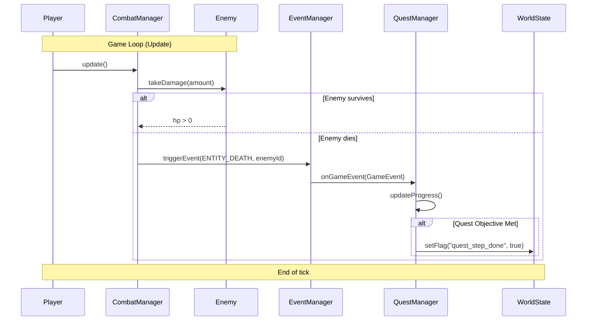
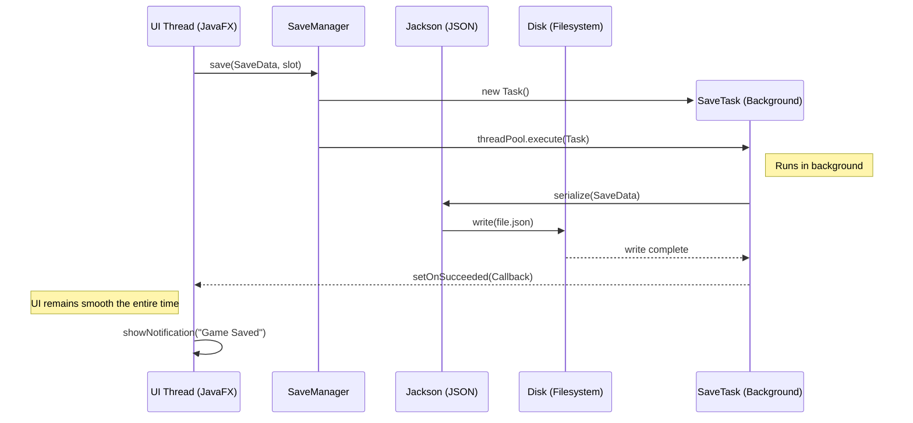

# Technical Documentation: DaoEngine - Path to Immortality

This document serves as a comprehensive technical guide to the **DaoEngine** game engine. The documentation details the software architecture, implementation details of key subsystems, and fulfillment of all requirements set by the semester project assignment.

---

## 1. Architectural Overview and Technologies

### 1.1 Tech Stack
The project is designed with an emphasis on modularity, performance, and easy extensibility. It utilizes modern Java technologies:

- **Java 21+**: Utilization of modern language features such as `switch expressions`, `sealed classes` (for states), and improved collection handling.
- **Maven**: Tool for project lifecycle management, dependency management, and build automation.
- **JavaFX 21**: Main framework for the graphical user interface. The engine relies on **Direct Canvas Rendering** (direct drawing to the canvas).
- **Jackson Databind (JSON)**: Key library for data serialization.
- **SLF4J & Logback**: Professional logging system.
- **JUnit 5 & Mockito**: Standard for automated testing.

---

## 2. Comprehensive Class Diagram (Mermaid)

The following diagram illustrates the complete architecture of DaoEngine, showing relationships between all major classes and subsystems.

```mermaid
classDiagram
    direction BT

    %% --- CORE & INFRASTRUCTURE ---
    subgraph Core_and_Infrastructure
        class DaoEngineApp {
            +start(Stage stage)
            -update(double dt)
            -render(GraphicsContext gc)
        }
        class Main { +main(String[] args) }
        class AssetRegistry { <<Singleton>> }
        class ConfigManager { <<Singleton>> }
        class GameConfig { <<POJO>> }
        class GameLogger { <<Static>> }
        class Input { <<Static>> }
        class SaveManager { <<Static>> }
        class SaveData { <<POJO>> }

        DaoEngineApp ..> AssetRegistry : initializes
        DaoEngineApp ..> ConfigManager : uses
        ConfigManager ..> GameConfig : loads
        SaveManager ..> SaveData : serializes
    end

    %% --- STATE MACHINE ---
    subgraph State_Management
        class GameState { <<interface>> }
        class MenuState
        class PlayState
        class PauseState
        class LoadState
        class LexiconState
        class LoadingState
        class GameOverState

        GameState <|.. MenuState
        GameState <|.. PlayState
        GameState <|.. PauseState
        GameState <|.. LoadState
        GameState <|.. LexiconState
        GameState <|.. LoadingState
        GameState <|.. GameOverState
        DaoEngineApp "1" *-- "1" GameState : current
    end

    %% --- ENTITY SYSTEM ---
    subgraph Entity_System
        class BaseEntity { <<abstract>> }
        class LivingEntity { <<abstract>> }
        class Player
        class Enemy
        class Projectile
        class WorldItem
        class InteractableEntity
        class GateOfRealms
        class LightningStrike
        class EnemyRegistry { <<Factory>> }
        class EnemyConfig

        BaseEntity <|-- LivingEntity
        LivingEntity <|-- Player
        LivingEntity <|-- Enemy
        BaseEntity <|-- Projectile
        BaseEntity <|-- WorldItem
        BaseEntity <|-- InteractableEntity
        InteractableEntity <|-- GateOfRealms
        Projectile <|-- LightningStrike

        EnemyRegistry ..> EnemyConfig : reads
        EnemyRegistry ..> Enemy : produces
    end

    %% --- LEVEL & WORLD ---
    subgraph World_Architecture
        class Level
        class LevelConfig
        class LevelLoader
        class GameMap
        class MapGenerator
        class Pathfinder
        class Biome { <<enumeration>> }
        class InteractableConfig

        PlayState "1" *-- "1" Level
        Level "1" *-- "1" GameMap
        Level "1" *-- "1" MapGenerator
        LevelLoader ..> Level : creates
        GameMap "1" *-- "1" Pathfinder
        MapGenerator ..> Biome : uses
        LevelLoader ..> LevelConfig : reads
    end

    %% --- RPG & LOGIC ---
    subgraph Game_Logic
        class CombatManager
        class QuestManager
        class Quest
        class CultivationManager
        class CultivationRank { <<enum>> }
        class AttributeSet
        class BuffManager
        class StatusEffectManager
        class StatusEffect { <<abstract>> }
        class TribulationTimer
        class WorldState { <<Singleton>> }
        class ParticleManager
        class SoundManager

        PlayState "1" *-- "1" CombatManager
        PlayState "1" *-- "1" QuestManager
        PlayState "1" *-- "1" CultivationManager
        PlayState "1" *-- "1" TribulationTimer
        PlayState "1" *-- "1" WorldState
        
        LivingEntity "1" *-- "1" AttributeSet
        LivingEntity "1" *-- "1" BuffManager
        LivingEntity "1" *-- "1" StatusEffectManager
        StatusEffectManager "1" *-- "*" StatusEffect
        CultivationManager ..> CultivationRank : manages
        QuestManager "1" *-- "*" Quest
    end

    %% --- ITEM SYSTEM ---
    subgraph Item_Management
        class Item { <<abstract>> }
        class Inventory
        class ItemRegistry { <<Factory>> }
        class WeaponItem
        class ConsumableItem
        class MaterialItem
        class SkillBookItem
        class ItemConfig
        class WeaponConfig
        class RecipeConfig

        Player "1" *-- "1" Inventory
        Inventory "1" *-- "*" Item
        Item <|-- WeaponItem
        Item <|-- ConsumableItem
        Item <|-- MaterialItem
        Item <|-- SkillBookItem
        ItemRegistry ..> ItemConfig : reads
        ItemRegistry ..> Item : produces
    end

    %% --- EVENT SYSTEM ---
    subgraph Event_Driven_Core
        class EventManager { <<Mediator>> }
        class GameEvent
        class GameEventListener { <<interface>> }

        EventManager ..> GameEvent : dispatches
        QuestManager ..|> GameEventListener : implements
        CombatManager ..> EventManager : notifies
    end

    %% --- UI & RENDERING ---
    subgraph UI_and_Visuals
        class WorldRenderer
        class PlayUIManager
        class DialogManager
        class DialogueRegistry
        class DialogueNode

        PlayState "1" *-- "1" WorldRenderer
        PlayState "1" *-- "1" PlayUIManager
        PlayUIManager "1" *-- "1" DialogManager
        DialogManager ..> DialogueRegistry : fetches
        DialogueRegistry ..> DialogueNode : contains
    end

    %% --- CROSS-SYSTEM CONNECTIONS ---
    CombatManager ..> LivingEntity : damage
    Pathfinder ..> GameMap : navigation
    SaveManager ..> PlayState : snapshots
    Quest ..> GameEvent : trigger conditions
    Level ..> WorldItem : spawns
```



### 2.2 Sequence Diagram: Combat Flow and Quest Update
This diagram illustrates the dynamic interaction between systems when an enemy is killed, leading to an update of the player's quest.



### 2.3 Sequence Diagram: Asynchronous Game Saving (Multithreading)
This diagram shows how the engine utilizes JavaFX `Task` to save the game in the background without freezing the user interface.



### 2.4 Project File Structure
Overview of the physical organization of source code and game data in the Maven project directory structure.

```text
DaoEngine/
├── src/
│   ├── main/
│   │   ├── java/org/example/
│   │   │   ├── entity/         # Entities (Player, Enemy, Projectile)
│   │   │   ├── item/           # Items and Inventory
│   │   │   ├── level/          # Maps, Generator, and Pathfinding
│   │   │   ├── logic/          # Core Logic (Combat, Quest, Sound)
│   │   │   │   └── event/      # Event-driven system
│   │   │   ├── render/         # Rendering (WorldRenderer)
│   │   │   ├── state/          # State Machine (PlayState, MenuState)
│   │   │   └── ui/             # GUI Managers
│   │   └── resources/
│   │       ├── enemies/        # Enemy configurations (JSON)
│   │       ├── items/          # Item and recipe definitions
│   │       ├── levels/         # Level, quest, and skill data
│   │       ├── sounds/         # Sound files (mp3)
│   │       └── textures/       # Graphical assets (png)
│   └── test/java/org/example/  # Unit and Integration tests
├── saves/                      # Directory for saved games
└── pom.xml                     # Maven configuration
```

### 2.5 Design Rationale

This section describes key decisions that influenced the final design of the engine.

#### 2.5.1 Direct Canvas vs. Scene Graph
**Decision**: The engine utilizes the JavaFX Canvas `GraphicsContext` for all in-game rendering instead of the standard Scene Graph (buttons and panels as nodes in a scene graph).
- **Reason**: The Scene Graph is memory-intensive when dealing with a large number of objects. Direct Canvas allows us to render thousands of tiles and particles without the overhead associated with managing thousands of Java objects in the scene memory.
- **Consequence**: Higher performance and smoother animations ("Silk & Ink" style).

#### 2.5.2 Data-Driven Design through Registries
**Decision**: All game content (enemy stats, weapon parameters, quest texts) is defined in external JSON files.
- **Reason**: Separation of data from logic (decoupling). This allows for changing game balance (e.g., weapon strength) without recompiling the entire project.
- **Consequence**: The engine is easily modifiable even for non-programmers.

#### 2.5.3 Event-Driven Logic (Mediator Pattern)
**Decision**: Communication between independent systems (e.g., Combat and Quest) occurs exclusively through the `EventManager`.
- **Reason**: Reducing coupling. `CombatManager` does not need to know about the existence of `QuestManager`. It only reports an "enemy death" event, and whoever is interested reacts to it.
- **Consequence**: The code is cleaner, more testable, and more easily extensible.

#### 2.5.4 Multithreading Strategy
**Decision**: JavaFX `Task` objects are used for I/O operations, while `ScheduledExecutorService` is used for time-critical events.
- **Reason**: The JavaFX UI thread must never be blocked. File operations (saving the game) run in the background, while the Tribulation timer runs in a daemon thread to ensure accuracy independent of rendering.
- **Consequence**: A stable and responsive application without "stuttering."

---

## 3. Detailed Catalog of all 75 Project Classes

Here is a complete list of all project classes with their detailed descriptions.

### 3.01 Class `DaoEngineApp`
- **Description**: Main application class orchestrating the game loop.
- **Responsibility**: Window initialization and state management.
- **Key Methods**: `start`, `update`, `render`.
- **Note**: Fulfills JavaFX orchestration requirements.

### 3.02 Class `AssetRegistry`
- **Description**: Singleton for managing graphical assets.
- **Responsibility**: Loading and caching Image objects and sprite slices.
- **Key Methods**: `getSprite`, `loadAssets`.
- **Note**: Optimizes memory usage.

### 3.03 Class `ConfigManager`
- **Description**: Manager for loading JSON configurations.
- **Responsibility**: Converting JSON files into Java objects.
- **Key Methods**: `saveConfig`, `getConfig`.
- **Note**: Crucial for Data-Driven design.

### 3.04 Class `GameLogger`
- **Description**: Wrapper for project logging.
- **Responsibility**: Outputting information to the console and files.
- **Key Methods**: `info`, `warning`, `error`.
- **Note**: Configurable at runtime.

### 3.05 Class `SaveManager`
- **Description**: Manager for saving and loading game states.
- **Responsibility**: Working with the filesystem.
- **Key Methods**: `save`, `load`.
- **Note**: Uses asynchronous Tasks.

### 3.06 Class `Input`
- **Description**: Manager for processing user inputs.
- **Responsibility**: Tracking key states.
- **Key Methods**: `isKeyPressed`, `isLmbPressed`.
- **Note**: Integrated with JavaFX events.

### 3.07 Class `BaseEntity`
- **Description**: Abstract base for all game objects.
- **Responsibility**: Position, size, and collision box.
- **Key Methods**: `render`.
- **Note**: Basic building block of the world.

### 3.08 Class `LivingEntity`
- **Description**: Entity with properties of a living organism.
- **Responsibility**: HP, Qi, and status effects.
- **Key Methods**: `takeDamage`, `heal`.
- **Note**: Base for Player and Enemy.

### 3.09 Class `Player`
- **Description**: Specific implementation of the player character.
- **Responsibility**: Controls, inventory, and leveling.
- **Key Methods**: `update`, `render`, `spendQi`.
- **Note**: Central character of the game.

### 3.10 Class `Enemy`
- **Description**: Adversary with automated behavior.
- **Responsibility**: AI logic and combat.
- **Key Methods**: `update`, `render`, `setStats`.
- **Note**: Loaded from EnemyRegistry.

### 3.11 Class `EnemyConfig`
- **Description**: Data class for enemy statistics.
- **Responsibility**: Holding data from JSON.
- **Key Methods**: Getters and setters.
- **Note**: Part of persistence.

### 3.12 Class `EnemyRegistry`
- **Description**: Registry for creating enemy instances.
- **Responsibility**: Factory pattern for entities.
- **Key Methods**: `createEnemy`.
- **Note**: Data-driven approach.

### 3.13 Class `Projectile`
- **Description**: Flying object in the combat system.
- **Responsibility**: Movement and hit detection.
- **Key Methods**: `update`, `checkCollision`.
- **Note**: Performance optimized.

### 3.14 Class `WorldItem`
- **Description**: Item lying in the game world.
- **Responsibility**: Pickable by the player.
- **Key Methods**: `onInteract`.
- **Note**: Created during loot drops.

### 3.15 Class `InteractableEntity`
- **Description**: Entity that can be interacted with.
- **Responsibility**: Triggering actions upon interaction.
- **Key Methods**: `onInteract`.
- **Note**: Chests, doors, etc.

### 3.16 Class `GateOfRealms`
- **Description**: Special gate between worlds.
- **Responsibility**: Transition between levels.
- **Key Methods**: `onInteract`.
- **Note**: Requires specific conditions.

### 3.17 Class `LightningStrike`
- **Description**: Lightning effect during Tribulation.
- **Responsibility**: Visual effect and damage.
- **Key Methods**: `update`, `render`.
- **Note**: Randomly generated.

### 3.18 Class `ConsumableItem`
- **Description**: Item intended for single use.
- **Responsibility**: Application of effect (healing).
- **Key Methods**: `use`.
- **Note**: Potions, food.

### 3.19 Class `Inventory`
- **Description**: Manager of items on a character.
- **Responsibility**: Adding, removing, and sorting.
- **Key Methods**: `addItem`, `removeItem`.
- **Note**: Persistent part of the save.

### 3.20 Class `Item`
- **Description**: Abstract base for all items.
- **Responsibility**: Identification and basic properties.
- **Key Methods**: `use`.
- **Note**: Polymorphic behavior.

### 3.21 Class `ItemConfig`
- **Description**: Item configuration in JSON.
- **Responsibility**: Metadata serialization.
- **Key Methods**: Data class (none).
- **Note**: Enables easy modding.

### 3.22 Class `ItemRegistry`
- **Description**: List of all available items.
- **Responsibility**: Searching for items by ID.
- **Key Methods**: `createItem`.
- **Note**: Singleton registry.

### 3.23 Class `MaterialItem`
- **Description**: Item for crafting.
- **Responsibility**: Raw materials for manufacturing.
- **Key Methods**: `use`.
- **Note**: Often drops from enemies.

### 3.24 Class `RecipeConfig`
- **Description**: Recipe definition for crafting.
- **Responsibility**: List of ingredients and result.
- **Key Methods**: Data class (none).
- **Note**: Loaded from JSON.

### 3.25 Class `SkillBookItem`
- **Description**: Item teaching new skills.
- **Responsibility**: Adding a Skill to the player.
- **Key Methods**: `use`.
- **Note**: Rare drop.

### 3.26 Class `WeaponConfig`
- **Description**: Specific data for weapons.
- **Responsibility**: Attack, range, speed.
- **Key Methods**: Data class (none).
- **Note**: Loaded via WeaponRegistry.

### 3.27 Class `WeaponItem`
- **Description**: Weapon implementation.
- **Responsibility**: Player's combat actions.
- **Key Methods**: `use`.
- **Note**: Extends Item.

### 3.28 Class `WeaponRegistry`
- **Description**: Registry of weapon types.
- **Responsibility**: Management of weapon data.
- **Key Methods**: `getWeaponConfig`.
- **Note**: Data-driven design.

### 3.29 Class `Biome`
- **Description**: Environment definition.
- **Responsibility**: Colors and enemy types.
- **Key Methods**: Getters.
- **Note**: Fire, Ice, Forest biomes.

### 3.30 Class `GameMap`
- **Description**: World grid representation.
- **Responsibility**: Collision detection and tile-data.
- **Key Methods**: `isSolid`, `getRandomFreePosition`.
- **Note**: Uses spatial grid.

### 3.31 Class `InteractableConfig`
- **Description**: Setting for interactive elements.
- **Responsibility**: Data for entities in the map.
- **Key Methods**: Data class (none).
- **Note**: JSON configuration.

### 3.32 Class `Level`
- **Description**: Layer/Floor of the game.
- **Responsibility**: Update and render of the entire level.
- **Key Methods**: Data class (none).
- **Note**: Manages entities.

### 3.33 Class `LevelConfig`
- **Description**: Level settings.
- **Responsibility**: Seed, difficulty, biome.
- **Key Methods**: Data class (none).
- **Note**: Loaded from JSON.

### 3.34 Class `LevelLoader`
- **Description**: Logic for transitioning between levels.
- **Responsibility**: Cleaning old and creating new data.
- **Key Methods**: `loadConfig`, `loadManifest`.
- **Note**: Triggered by portal.

### 3.35 Class `MapGenerator`
- **Description**: Procedural world generation.
- **Responsibility**: Cellular automata and noise.
- **Key Methods**: `generate`.
- **Note**: Creates unique maps.

### 3.36 Class `Pathfinder`
- **Description**: Pathfinding in the map.
- **Responsibility**: A* algorithm.
- **Key Methods**: `findPath`.
- **Note**: Used by enemies.

### 3.37 Class `AttributeSet`
- **Description**: Character statistics.
- **Responsibility**: Strength, agility, durability.
- **Key Methods**: `calculateModifiers`.
- **Note**: Influenced by cultivation.

### 3.38 Class `BuffManager`
- **Description**: Management of temporary bonuses.
- **Responsibility**: Updating duration of effects.
- **Key Methods**: `applyBuff`.
- **Note**: Part of LivingEntity.

### 3.39 Class `CombatManager`
- **Description**: Heart of the combat system.
- **Responsibility**: Calculation of damage and hits.
- **Key Methods**: `update`, `handleFiring`.
- **Note**: Central manager.

### 3.40 Class `CultivationManager`
- **Description**: Growth of character power.
- **Responsibility**: Qi and ranks.
- **Key Methods**: `attemptBreakthrough`.
- **Note**: Dao path to immortality.

### 3.41 Class `CultivationRank`
- **Description**: Definition of power level.
- **Responsibility**: Rank name and bonuses.
- **Key Methods**: Getters.
- **Note**: E.g., Golden Core.

### 3.42 Class `CultivationRegistry`
- **Description**: Loading ranks from JSON.
- **Responsibility**: Management of rank data.
- **Key Methods**: `getRank`.
- **Note**: Data-driven RPG.

### 3.43 Class `DialogueChoice`
- **Description**: Player choice in a dialogue.
- **Responsibility**: Successive node.
- **Key Methods**: Getters.
- **Note**: Tree structure.

### 3.44 Class `DialogueNode`
- **Description**: Node in a conversation.
- **Responsibility**: Text and choice list.
- **Key Methods**: `addChoice`, Getters.
- **Note**: Loaded from JSON.

### 3.45 Class `DialogueRegistry`
- **Description**: Registry of all conversations.
- **Responsibility**: Management of dialogue data.
- **Key Methods**: `getNode`.
- **Note**: Localizable content.

### 3.46 Class `Interactable` (Interface)
- **Description**: Interface for anything interactable in the world.
- **Responsibility**: Defines standard for interaction mechanics (prompts, range).
- **Key Methods**: `onInteract`.
- **Note**: Implemented by entities.

### 3.47 Class `LootRegistry`
- **Description**: Loot tables.
- **Responsibility**: Generation of drops.
- **Key Methods**: `rollLoot`.
- **Note**: Random generation.

### 3.48 Class `ParticleManager`
- **Description**: Management of visual particles.
- **Responsibility**: Blood, sparks, effects.
- **Key Methods**: `spawnHitSpark`, `update`.
- **Note**: Visual element only.

### 3.49 Class `Quest`
- **Description**: Quest definition.
- **Responsibility**: Objectives and rewards.
- **Key Methods**: `isCompleted`.
- **Note**: Loaded from registry.

### 3.50 Class `QuestManager`
- **Description**: Tracking progress in quests.
- **Responsibility**: Updating state of active quests.
- **Key Methods**: `onGameEvent`, `addQuest`.
- **Note**: Reacts to EventManager.

### 3.51 Class `QuestRegistry`
- **Description**: Quest registry.
- **Responsibility**: Management of quest data.
- **Key Methods**: `createQuest`.
- **Note**: JSON definition.

### 3.52 Class `Skill`
- **Description**: Active ability.
- **Responsibility**: Effect logic and cooldown.
- **Key Methods**: Getters and Setters.
- **Note**: Used by player and AI.

### 3.53 Class `SkillRegistry`
- **Description**: Skill registry.
- **Responsibility**: Loading skills from JSON.
- **Key Methods**: `getSkill`.
- **Note**: Extensibility.

### 3.54 Class `SoundManager`
- **Description**: Audio management.
- **Responsibility**: Music and effects.
- **Key Methods**: `playSound`.
- **Note**: Asynchronous playback.

### 3.55 Class `StatusEffect`
- **Description**: Effect on an entity.
- **Responsibility**: Changing stats over time.
- **Key Methods**: `apply`.
- **Note**: Poison, slow.

### 3.56 Class `StatusEffectManager`
- **Description**: Management of active effects.
- **Responsibility**: Updating duration.
- **Key Methods**: `update`.
- **Note**: Part of LivingEntity.

### 3.57 Class `TribulationTimer`
- **Description**: Independent timer.
- **Responsibility**: Countdown to threat.
- **Key Methods**: `start`.
- **Note**: Own thread.

### 3.58 Class `WorldState`
- **Description**: Global world state.
- **Responsibility**: Quest flags and progress.
- **Key Methods**: `getFlag`.
- **Note**: Persistent.

### 3.59 Class `EventManager`
- **Description**: Event bus.
- **Responsibility**: Event dispatching.
- **Key Methods**: `triggerEvent`.
- **Note**: Pub/Sub pattern.

### 3.60 Class `GameEvent`
- **Description**: Event object.
- **Responsibility**: Type and event data.
- **Key Methods**: Getters.
- **Note**: Extensible.

### 3.61 Class `GameEventListener` (Interface)
- **Description**: Event listener.
- **Responsibility**: Reaction to event.
- **Key Methods**: `onEvent`.
- **Note**: Implemented by managers.

### 3.62 Class `WorldRenderer`
- **Description**: World rendering.
- **Responsibility**: Direct Canvas rendering.
- **Key Methods**: `render`.
- **Note**: Z-ordering of entities.

### 3.63 Class `GameOverState`
- **Description**: State after loss.
- **Responsibility**: Restart or menu.
- **Key Methods**: `render`.
- **Note**: State pattern.

### 3.64 Class `GameState` (Interface)
- **Description**: Contract for states.
- **Responsibility**: Update and render.
- **Key Methods**: `update`.
- **Note**: Central to the application.

### 3.65 Class `LexiconState`
- **Description**: Game encyclopedia.
- **Responsibility**: Displaying knowledge.
- **Key Methods**: `render`.
- **Note**: Accessible from menu.

### 3.66 Class `LoadingState`
- **Description**: Loading screen.
- **Responsibility**: Asynchronous preload.
- **Key Methods**: `update`, `render`.
- **Note**: Progress visualization.

### 3.67 Class `LoadState`
- **Description**: Save selection menu.
- **Responsibility**: Listing slots.
- **Key Methods**: `update`, `render`.
- **Note**: Interaction with SaveManager.

### 3.68 Class `MenuState`
- **Description**: Main menu.
- **Responsibility**: Game start, exit.
- **Key Methods**: `update`, `render`.
- **Note**: Initial state.

### 3.69 Class `PauseState`
- **Description**: Game pause.
- **Responsibility**: Save, settings, resume.
- **Key Methods**: `render`.
- **Note**: Triggered by ESC.

### 3.70 Class `PlayState`
- **Description**: Core of the game.
- **Responsibility**: Orchestration of game systems.
- **Key Methods**: `update`.
- **Note**: Main game loop.

### 3.71 Class `DialogManager`
- **Description**: GUI for dialogues.
- **Responsibility**: Rendering text.
- **Key Methods**: `startDialogue`, `advance`.
- **Note**: Typewriter effect.

### 3.72 Class `PlayUIManager`
- **Description**: HUD management.
- **Responsibility**: HP bars, Qi bars, icons.
- **Key Methods**: `render`.
- **Note**: In-game GUI.

### 3.73 Class `SaveData`
- **Description**: POJO for saving.
- **Responsibility**: Holding data for Jackson.
- **Key Methods**: Getters/Setters.
- **Note**: Serializable.

### 3.74 Class `GameConfig`
- **Description**: Application configuration.
- **Responsibility**: Global settings.
- **Key Methods**: Getters.
- **Note**: Loaded at startup.

### 3.75 Class `Main`
- **Description**: Entry point.
- **Responsibility**: JVM startup.
- **Key Methods**: `main`.
- **Note**: Necessary for JAR execution.

---

## 4. Fulfillment of Assignment Requirements

### 4.1 Java and Maven
The project runs on Java 21 and uses Maven for building. This makes it easy to run the project on any machine with the correct JDK, and all libraries (Jackson, JavaFX, JUnit) are downloaded automatically.

### 4.2 Graphics and UI
Most of the GUI is handled purely in code via JavaFX to have maximum control over how things move and look. For the game itself, we use Canvas, which gave us a free hand in animations and rendering thousands of objects without lag.

### 4.3 Multithreading
To ensure the game doesn't stutter while saving, we use JavaFX Tasks in the background. Additionally, a ScheduledExecutor handles timed events (like Tribulation), which works independently of how fast the game is currently rendering.

---

## 5. Conclusion and Personal Evaluation

Working on DaoEngine was a great challenge that I incredibly enjoyed and taught me many new things about game development. Even though I still struggle to remember the entire Java syntax and have to check documentation or Google frequently, this project allowed me to express my love for the xianxia genre directly through functional code. The hardest part was combining all the registries and managers so that the system worked as a whole, but the result made me very happy. I am most proud of how the EventManager works and how I managed to bring concepts like cultivation and tribulations, which I love as a xianxia fan, into the game. Overall, this project gave me a lot; it taught me to think about architecture and showed me the joy of simply combining my favorite genre with programming.
