# 仙 DaoEngine: Path to Immortality - Game Manual

Welcome to the game manual for **DaoEngine**. This document will guide you through the installation, in-depth mechanics, and your character's journey from a mere mortal to a celestial ruler.

---

## 1. Introduction and Epic Story: Shards of Eternity

The world of DaoEngine is no ordinary world. It is a **"Prison Realm"**, created by an ancient artifact to trap the essences of the most powerful beings who ever walked the Path of Dao. Here, the heavens are shattered, and time flows in endless cycles.

### The Legend of the DaoEngine Pantheon
This world is a graveyard of gods. Every stele you find carries the soul imprint of one of the legends who shaped the history of the multiverse. These fragments are divided into several streams of power:

- **The Venerables**:
    - **Fang Yuan (Great Love)**: Whose ruthless desire for eternal life and disregard for emotions are legendary. He believes that there are no eternal enemies, only eternal benefits.
    - **Spectral Soul**: A bloodthirsty shadow whose path was paved with the souls of billions of mortals and cultivators alike. His madness and bloodlust once extinguished the sun.
    - **Paradise Earth & Red Lotus**: The former brings peace and kindness, the latter eternal regret and the quest to change the past through the River of Time.

- **The Ancients**:
    - **Tu Si & Xuan Luo**: The last of the Ancient God and Dao lineages, whose bodies bore the weight of stars and whose blood is the essence of existence itself.
    - **Ta Ji & Chi Hu**: Representatives of the Ancient Devils and Giant Demon clans, who believe only in raw power and crushing the heavens with their fists.

- **The Defiers and Chosen**:
    - **Wang Lin**: The God of Death, who walked the path of vengeance and solitude to prove that his life belongs to him, not the heavens.
    - **Situ Nan**: A mad genius and prisoner of a magical pearl, who will insult you until you learn true cultivation.
    - **All Seer**: The Chessplayer of Fate, who sees every falling leaf as part of his grand game.

- **Tragic Souls**:
    - **Bo Qing**: A sword genius whose blade could split 5 regions and 2 heavens. He was considered the strongest directly below the Venerables.
    - **Bai Ning Bing**: A young genius obsessed with combat, who chose a magnificent, albeit short, life in the frost over an eternity of grayness.
    - **Zhou Yi**: Forever waiting in the rain for the one he lost, the embodiment of unwavering love.
    - **Fang Zheng**: His brother's shadow, consumed by burning jealousy and the desire to prove his worth.

- **Aspects of Chaos**:
    - **Greed**: A bottomless hunger that seeks to devour heaven and earth and will never be satisfied.
    - **Difuz (Void Glutton)**: A world-eater whose hunger is a black hole, seeking to swallow the sun, stars, and time itself.

### Your Role: The One Who Defies Fate
You begin as a nobody in **Mortal Valley**. Your guides are **Senior Han**, who once served in the celestial halls, and **Elder Mo**, a blacksmith attempting to forge a weapon capable of piercing fate. You must pass through the **Nine Bridges** under the supervision of **Senior Wang** and face the trials of **Sword Saint Shen** to prove that your will is strong enough.

Your true goal is not a final boss, but the **Eternal Path**. Collect enough Qi and Realm Tokens to transition seamlessly into increasingly powerful **Realms**. Each new world is more dangerous, the enemies stronger, and the tribulations more devastating. Your task is to "Trample the Heavens" in an infinite cycle of cultivation and become a legend whose name will one day be carved into steles for future generations of cultivators.

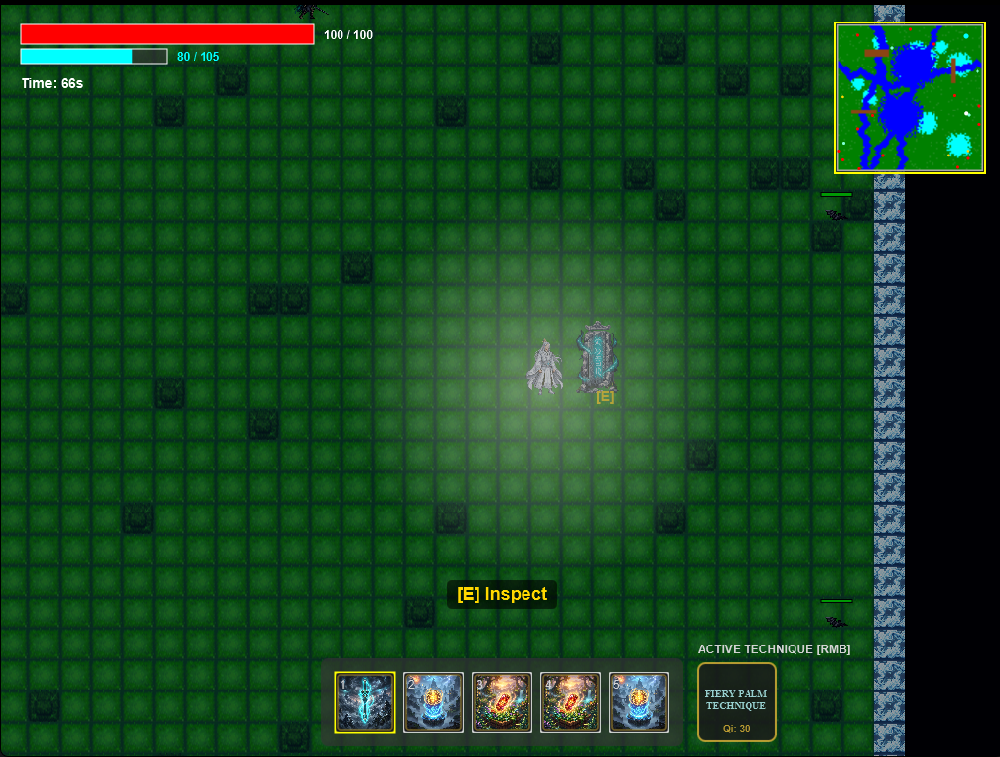

---

## 2. Installation and Launch

### Requirements
- **Java JDK 21** or newer (runs on JavaFX).
- **Maven** (for building).
- **RAM**: Minimum 2 GB of free memory.

### Launching the Game
1. Download/clone the repository.
2. Open a terminal in the root directory and run: `mvn javafx:run`.
3. The game will automatically build and launch the main menu.

---

## 3. Main Menu
After launching, the main menu with an interactive background will appear:
- **New Game**: Start a new journey (overwrites temporary data).
- **Load Game**: Choose from 5 save slots on the disk.
- **Lexicon**: World encyclopedia (items, enemies, recipes).
- **Exit**: Close the application.

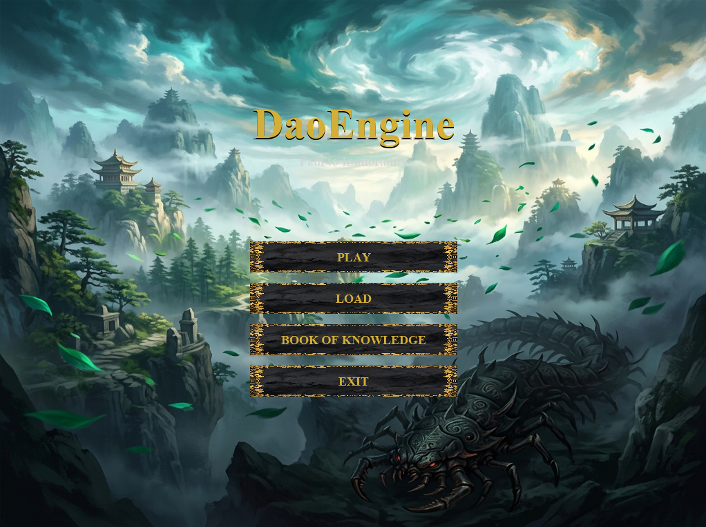

---

## 4. Controls
The game uses smooth controls combining keyboard and mouse cursor:

| Action | Key | Description |
| :--- | :--- | :--- |
| **Movement** | `W`, `A`, `S`, `D` | Move in four directions. |
| **Basic Attack** | `LMB` (Left Click) | Attack with weapon towards the cursor. |
| **Active Technique** | `RMB` (Right Click) | Activates special technique (costs Qi). |
| **Meditation** | `Spacebar` | Draws Qi from the surroundings. You cannot move while meditating. |
| **Interaction** | `E` | Talk to NPCs, pick up items, activate gates and steles. |
| **Inventory** | `I` | Manage items and crafting. |
| **Quest Log** | `Q` | List of active and completed quests. |
| **World Map** | `M` | Displays the full map. |
| **Cultivation** | `C` | Menu with details about your progress and rank. |
| **Breakthrough** | `B` | Quick key to attempt a Breakthrough. |
| **Use Hotbar** | `F` | Uses the item in the selected hotbar slot. |
| **Hotbar Slots** | `1` to `5` | Switch between items in the hotbar. |
| **Pause / Menu** | `Esc` | Pause menu and saving. |

> **Dialogue Note**: During a conversation with an NPC, you can continue by pressing `E` or clicking. If you have multiple choices, you can select them by clicking directly on the text or using the number keys `1`, `2`, `3`, etc.

---

## 5. Game Mechanics

### 5.1 Cultivation and Qi
Your character has two main indicators: **HP (Health)** and **Qi (Energy)**.
- **Gaining Qi**: By meditating (holding `Spacebar`), killing enemies, or consuming pills.
- **Breakthrough**: After reaching maximum Qi capacity, press `B`. A Breakthrough permanently increases your stats (**HP**, **Strength**, **Defense**) and immediately **fully heals you**.

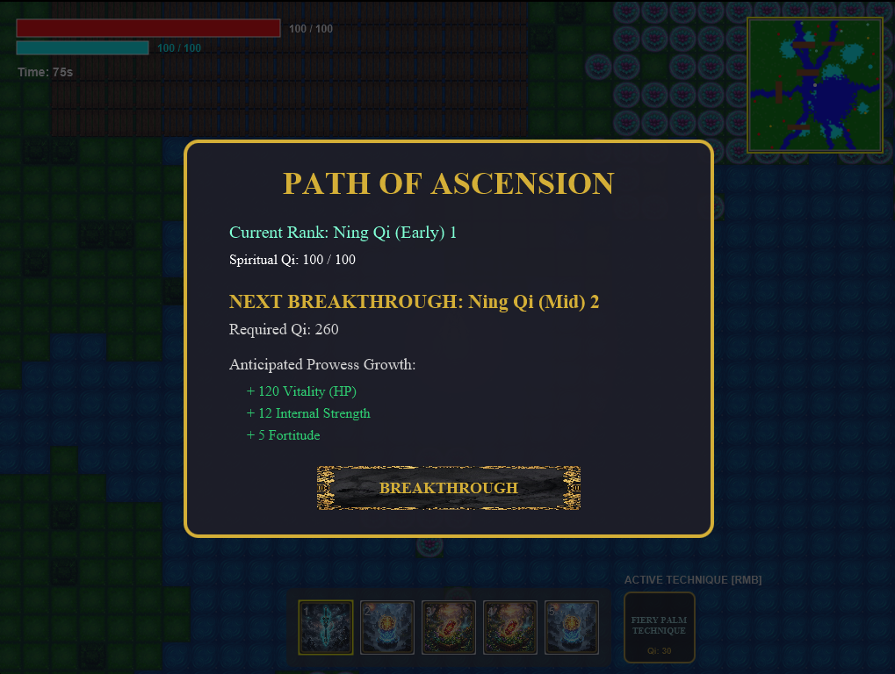

### 5.2 World and Biomes
DaoEngine generates worlds dynamically. Each biome has unique properties:
- **Forest (Forest Realm)**: A harmonious and calming landscape full of greenery. This is the most common environment where your journey for immortality begins.
- **Ice (Ice Tundra)**: A wasteland covered in eternal ice and snow. A visually cold environment that emphasizes the loneliness of a cultivator's path.
- **Fire (Volcanic Depths)**: A dark world illuminated by the heat of liquid lava. This environment feels the most dangerous and forms a dramatic backdrop for your battles.

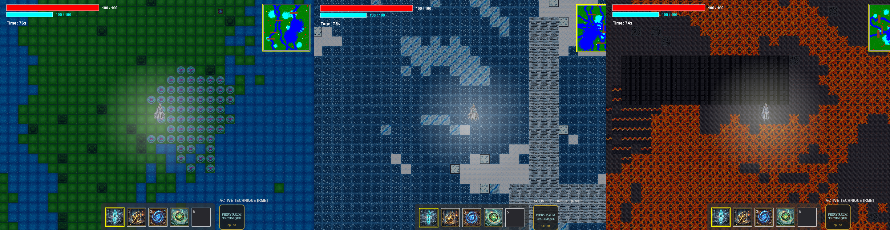

### 5.3 Heavenly Tribulations
At certain intervals (watch the timer in the HUD) or during a breakthrough, the heavens will send lightning down upon you.
- **Warning**: A subtle mark appears on the ground before a strike. Once it appears, you must move away as quickly as possible.
- **Tactic**: Lightning also damages enemies; you can lure them into the strike zones!

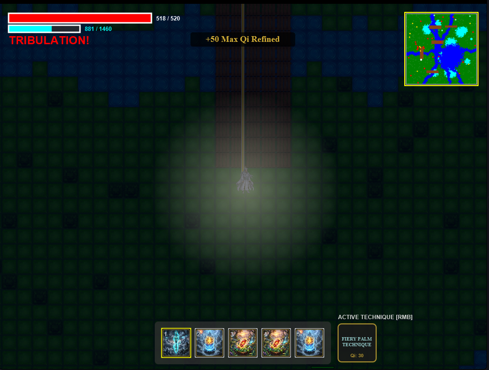

---

## 6. Combat Techniques (Skills)
You can only have one technique active at a time. New ones are learned from **Skill Books**.
- **Fiery Palm**: A fan of fireballs.
- **Void Sword Slash**: A piercing sword strike with high damage.
- **Thunder Clap**: A lightning discharge with extreme speed.
- **Soul Devourer**: A giant sphere of energy destroying everything in its path.

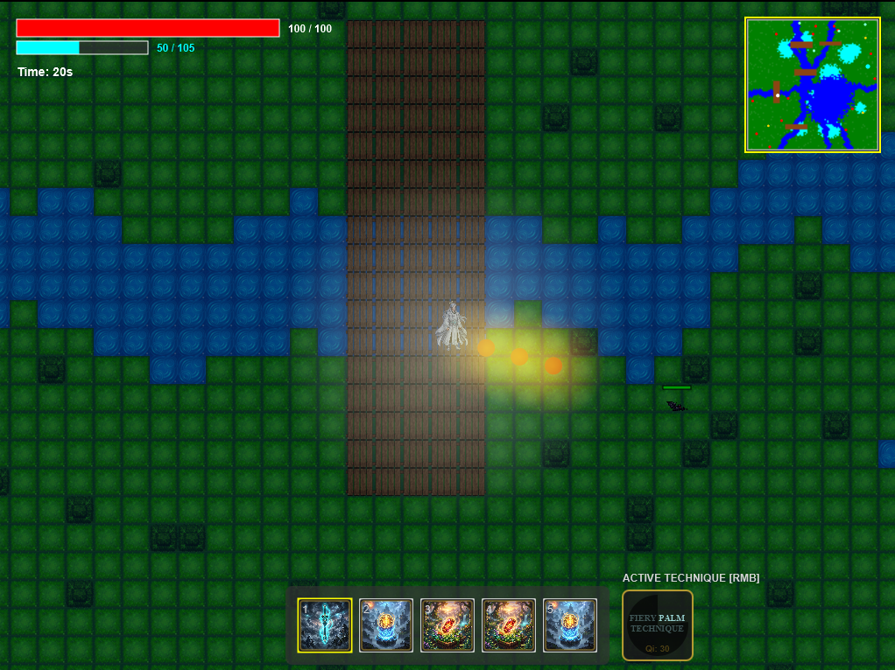

---

## 7. Level Goals and Progression
Each level (Realm) has limited time and can be completed in two ways:
1. **Path of Power (Survival)**: Survive until the timer expires and defeat all waves of **Heavenly Tribulation**.
2. **Path of the Artifact (Realm Token)**: Find a **Realm Token** and bring it to the **Gate of Realms**.

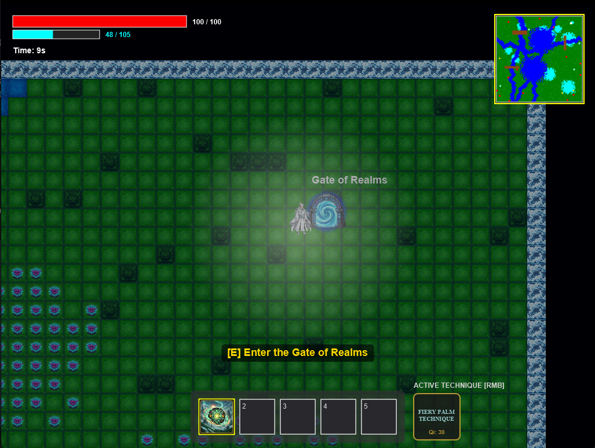

---

## 8. User Interface (HUD)
1. **Top Left**: HP and Qi bars. Below them, the **Quest Log and Tribulation Timer**.
2. **Top Right**: Minimap.
3. **Bottom Center**: Hotbar with slots 1-5.
4. **Bottom Right (Next to hotbar)**: Active technique icon and cooldown.

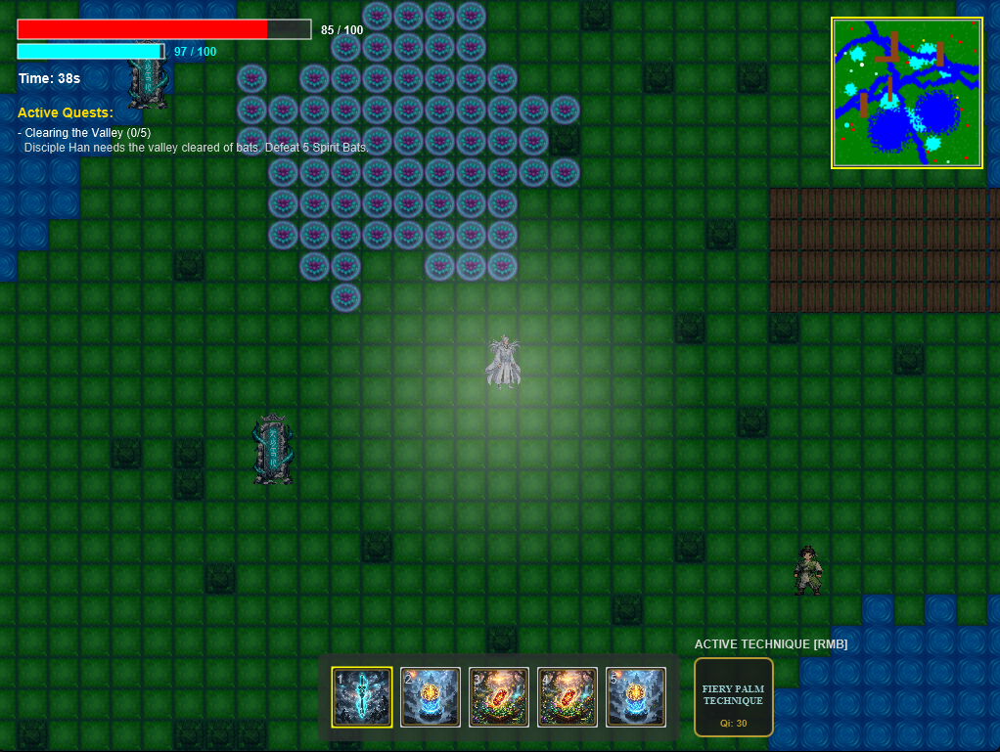

### 8.1 Map Legend
The minimap (top right) and large map (`M`) use color coding for quick orientation:

**Terrain Colors (Tiles):**
- **Green**: Grass and open terrain suitable for movement.
- **Blue**: Water (rivers and lakes).
- **Turquoise**: Spirit Veins – ideal places for meditation with increased Qi gain.
- **Gray**: Walls, rocks, and impassable obstacles.
- **Brown**: Bridges allowing passage over water.

**Entity Icons (Points on the map):**
- **White Point**: Your current position.
- **Red Point**: Enemies (monsters and guardians).
- **Gold Point**: Items on the ground ready to be picked up.
- **Turquoise Point**: NPC characters and Spirit Steles.
- **Large Turquoise Point**: Gate of Realms (Portal to the next world).

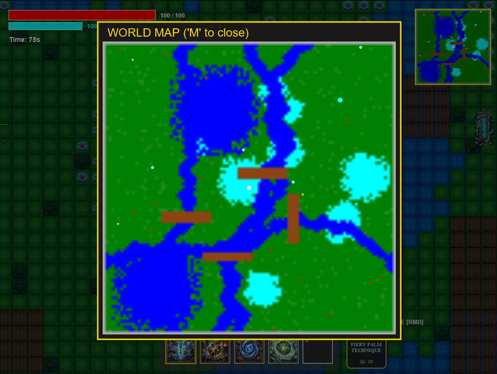

---

## 9. NPCs, Steles, and Dialogues
- **NPCs**: You can talk to them (`E`), receive quests, or trade with them.
- **Spirit Steles**: Monuments providing **permanent bonuses** to stats.
- **Dialogues**: Select options by clicking or using keys `1`-`9`.

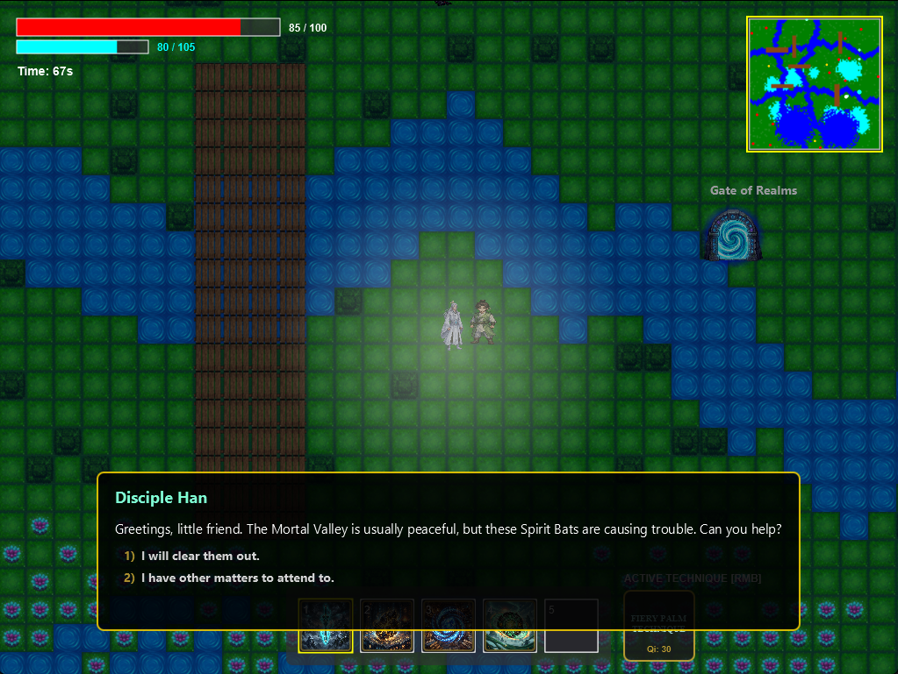

---

## 10. Inventory and Crafting
In the inventory (`I`), you can craft items:
- **Recipes**: List in the right part of the inventory.
- **Materials**: Iron Ore, Spirit Herb, Magic Essence, etc.
- **Manipulation (Drag & Drop)**: Move items freely by holding the left mouse button. You can also place them into hotbar slots (1-5).
- **Dropping**: Drop an item by dragging it outside the inventory window or onto the trash icon.
- **Trash**: Permanently destroy items by dragging them onto the trash icon in the bottom right corner.

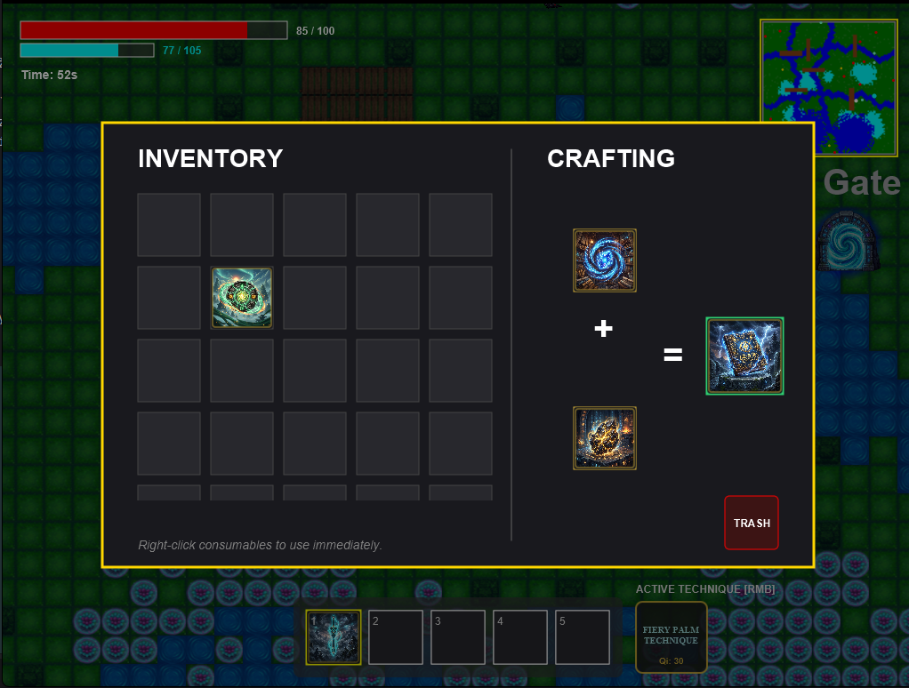

---

## 11. Lexicon (Book of Knowledge)
Your personal encyclopedia available from the menu:
- **Bestiary**: Stats and behavior of all discovered monsters.
- **Item Atlas**: Details about every item found.
- **Recipes**: Overview of all your crafting knowledge.
- **Cultivation**: Overview of all cultivation levels.

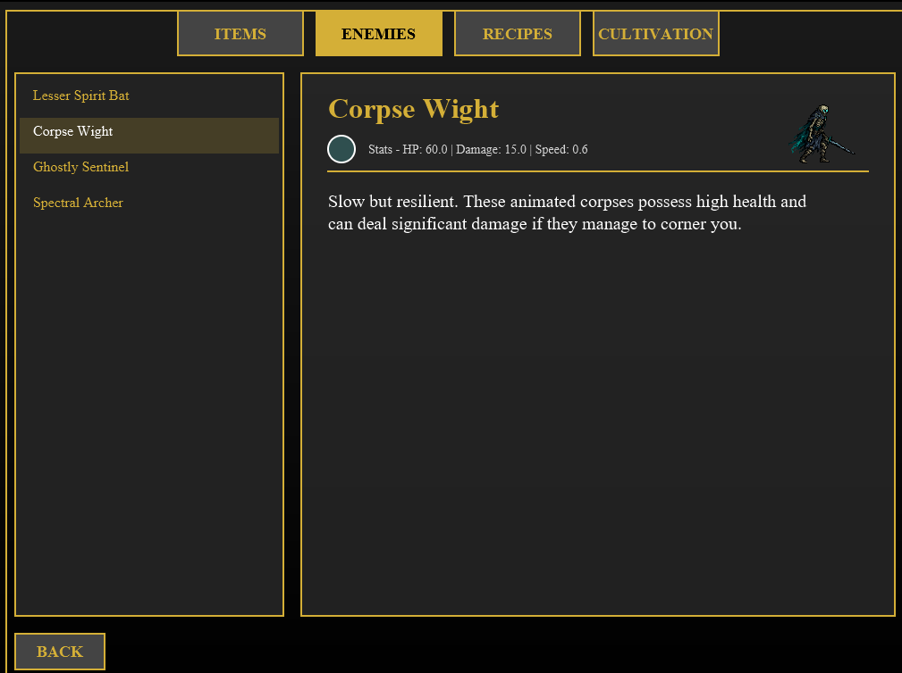

---

## 12. Saving and Game Over
- **Saving**: In the pause menu (`Esc`), select slot 1-5. Saving is asynchronous.
- **Death**: After death, you will see a "DEFEAT" screen. You can load your last save.
- **Recommendation**: Save your game often! Without saving, you lose all progress in the current level upon death.

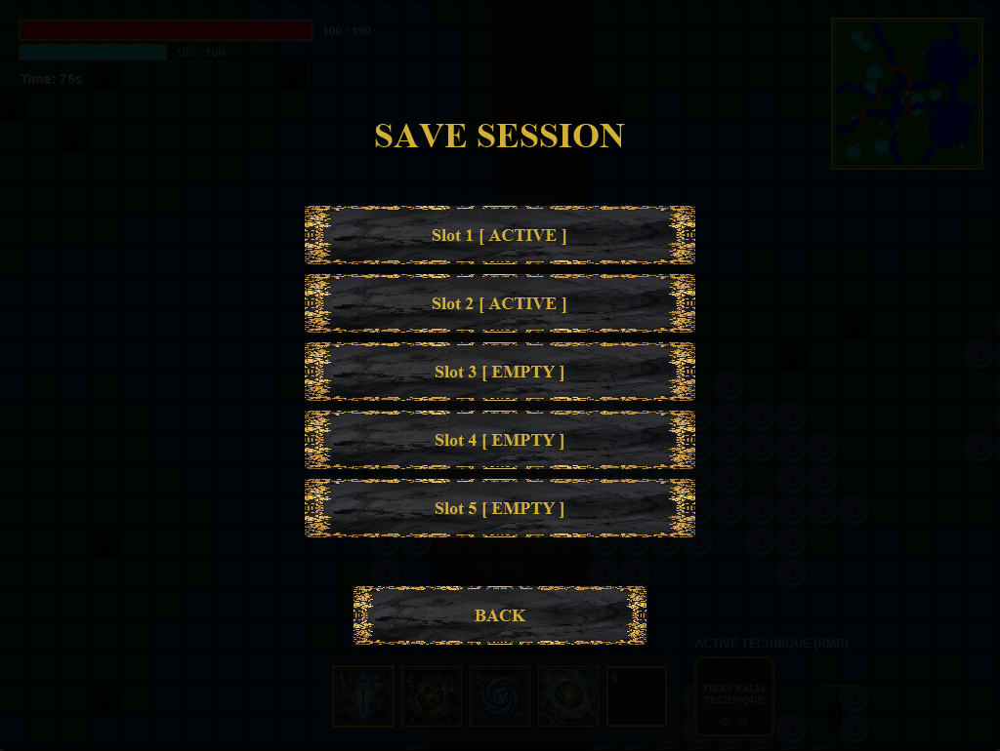
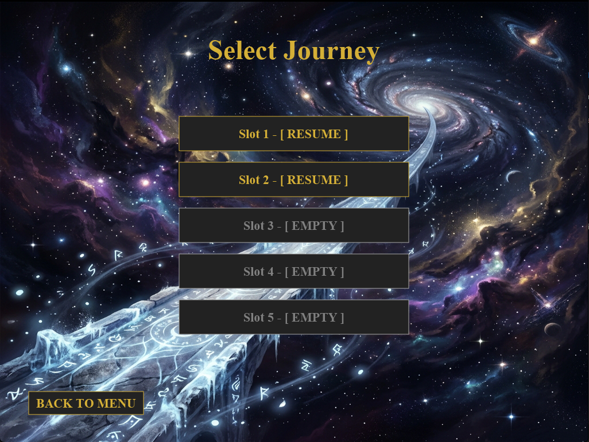
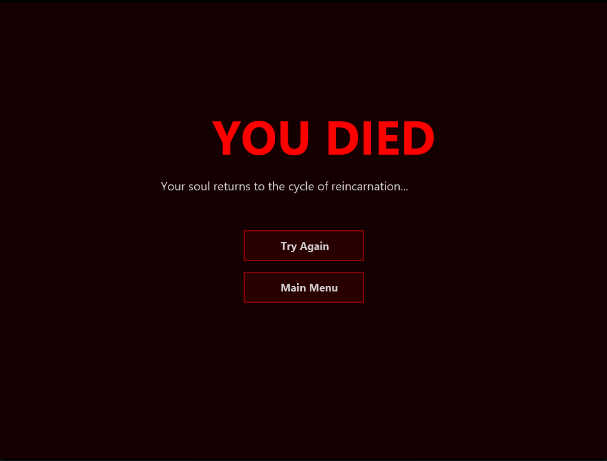

---

## 13. FAQ
**The game is lagging, what should I do?**
- Try lowering the target FPS or disabling debug mode in `game_config.json`.

**Where can I find my saves?**
- Saves are stored in the `/saves` folder in `.json` format.

---

© 2026 DaoEngine <3
