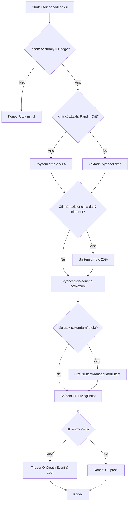

# 2. Testovací scénáře

Tato kapitola obsahuje detailní návrh testovacích scénářů, analýzu vstupů a procesní testy pro klíčové funkce **DaoEngine**.

## 2.1 Testy vstupů (Input Testing)
Pro analýzu byla vybrána kritická metoda `SaveManager.save(SaveData data, int slot)`, která zajišťuje perzistenci herního stavu. Tato metoda je netriviální, protože kombinuje validaci parametrů s externí I/O operací a serializací.

### 2.1.1 Analýza ekvivalentních tříd (EC)
Ekvivalentní třídy rozdělují definiční obor vstupů na skupiny, které by se měly z pohledu systému chovat stejně.

| Parametr | Třída (EC) | Definice | Typ | Očekávané chování |
| :--- | :--- | :--- | :--- | :--- |
| **slot** | EC1 | {1, 2, 3, 4, 5} | Platná | Úspěšné uložení do slotu. |
| | EC2 | {..., -1, 0} | Neplatná | Vyhození `IllegalArgumentException`. |
| | EC3 | {6, 7, ...} | Neplatná | Vyhození `IllegalArgumentException`. |
| **data** | EC4 | Validní `SaveData` objekt | Platná | Správná serializace do JSON. |
| | EC5 | `null` | Neplatná | Vyhození `NullPointerException` nebo custom exception. |
| | EC6 | `SaveData` s nekonzistentním stavem | Platná (z pohledu typu) | Serializace proběhne, ale logika aplikace může selhat při načítání. |

### 2.1.2 Mezní hodnoty (Boundary Value Analysis - BVA)
Mezní hodnoty testují hranice mezi ekvivalentními třídami, kde je nejvyšší pravděpodobnost chyby (např. záměna `<` za `<=`).

| Parametr | Mez | Hodnota | Testovaný stav |
| :--- | :--- | :--- | :--- |
| **slot** | Dolní hranice | 1 | Platné minimum |
| | Těsně pod dolní | 0 | Neplatné (hranice EC2) |
| | Horní hranice | 5 | Platné maximum |
| | Těsně nad horní | 6 | Neplatné (hranice EC3) |

### 2.1.3 Pairwise Testing
Technika Pairwise Testing zajišťuje, že jsou otestovány všechny kombinace dvojic vstupních parametrů, což statisticky odhalí většinu chyb.

| ID | Data (P1) | Slot (P2) | Typ testu | Očekávaný výsledek |
| :--- | :--- | :--- | :--- | :--- |
| **T01** | Validní | 1 (Min) | Pozitivní | Úspěšné uložení |
| **T02** | Validní | 5 (Max) | Pozitivní | Úspěšné uložení |
| **T03** | Validní | 0 (Invalid) | Negativní | `IllegalArgumentException` |
| **T04** | `null` | 1 | Negativní | `NullPointerException` |
| **T05** | `null` | 6 (Invalid) | Negativní | Priorita validace slotu |
| **T06** | Nekonzistentní | 3 (Mid) | Pozitivní | Serializace (systém je robustní) |
| **T07** | Validní | 100 | Negativní | `IllegalArgumentException` |

---

## 2.2 Testy průchodů (Process Testing)
V této sekci analyzujeme komplexní proces aplikace poškození v souboji. Tento proces byl vybrán pro svou netrivialitu a vysoký počet rozhodovacích bodů (5+), což umožňuje hloubkovou analýzu logiky enginu.

### 2.2.1 Komplexní proces: Výpočet a aplikace poškození (Combat Damage Flow)
Tento proces popisuje cestu od dopadu útoku na cíl až po vyhodnocení smrti a generování lootu.

### 2.2.2 Analýza průchodů (TDL 2)
Technika TDL 2 (Test Design Language level 2) vyžaduje pokrytí všech hran v grafu. Pro tento komplexní proces byly definovány následující testovací průchody:

| ID | Název průchodu | Popis cesty (Hrany / Rozhodnutí) | Očekávaný výsledek |
| :--- | :--- | :--- | :--- |
| **P1** | Miss Path | D1 (Ne) | Útok okamžitě končí bez efektu na cíl. |
| **P2** | Normal Hit (Survival) | D1 (Ano) -> D2 (Ne) -> D3 (Ne) -> D4 (Ne) -> D5 (Ne) | Standardní poškození, žádný efekt, cíl přežije. |
| **P3** | Critical Resistance Hit | D1 (Ano) -> D2 (Ano) -> D3 (Ano) -> D4 (Ne) -> D5 (Ne) | Kritický zásah, ale snížený rezistencí, cíl přežije. |
| **P4** | Effect Application | D1 (Ano) -> D2 (Ne) -> D3 (Ne) -> D4 (Ano) -> D5 (Ne) | Zásah s aplikací stavového efektu (např. oheň). |
| **P5** | Lethal Critical Hit | D1 (Ano) -> D2 (Ano) -> D3 (Ne) -> D4 (Ne) -> D5 (Ano) | Kritický zásah bez rezistence, který zabije cíl a vyvolá loot. |
| **P6** | Minimal Survivable Hit | D1 (Ano) -> D2 (Ne) -> D3 (Ano) -> D4 (Ano) -> D5 (Ne) | Nejslabší zásah (rezistence + efekt), který cíl těsně přežije. |

---

## 2.3 Detailní testovací scénáře (Manual Test Cases)
Následující scénáře jsou určeny pro manuální verifikaci komplexních funkcí.

### Scénář DS-01: Perzistence herního stavu (Save/Load)
| Atribut | Hodnota |
| :--- | :--- |
| **ID** | DS-01 |
| **Priorita** | Kritická |
| **Modul** | SaveManager / PlayState |
| **Předpoklad** | Aplikace v PlayState, dostupný volný slot 1. |

**Kroky:**
1. Hráč zabije 2 nepřátele a získá 100 XP.
2. Hráč sebere předmět "Void Shard" (ověření inventáře).
3. Hráč otevře menu a uloží hru do slotu 1.
4. Hráč změní pozici (podejde o 200px doprava).
5. Hráč načte hru ze slotu 1.

**Očekávaný výsledek:**
- Hráč má po načtení přesně 100 XP.
- "Void Shard" je v inventáři.
- Hráč se vrátil na pozici, kde hru ukládal (ne na novou pozici z kroku 4).
- Nepřátelé jsou stále mrtví (stav světa perzistoval).

### Scénář DS-02: Interakce Questu a Inventáře
| Atribut | Hodnota |
| :--- | :--- |
| **ID** | DS-02 |
| **Priorita** | Vysoká |
| **Modul** | QuestManager / Inventory |
| **Předpoklad** | Hráč má aktivní quest "Sběr bylin" (potřeba 3 ks). |

**Kroky:**
1. Hráč sebere 1. bylinu.
2. Hráč sebere 2. bylinu.
3. Hráč zahodí 1 bylinu z inventáře.
4. Hráč sebere 3. bylinu.

**Očekávaný výsledek:**
- Po kroku 2 je progres questu 2/3.
- Po kroku 3 musí progres klesnout na 1/3 (pokud je quest vázán na stav inventáře) NEBO zůstat 2/3 (pokud je vázán na akci sběru). *Pozn: DaoEngine používá akci sběru.*
- Po kroku 4 je progres 3/3 a quest je označen jako splněný.
