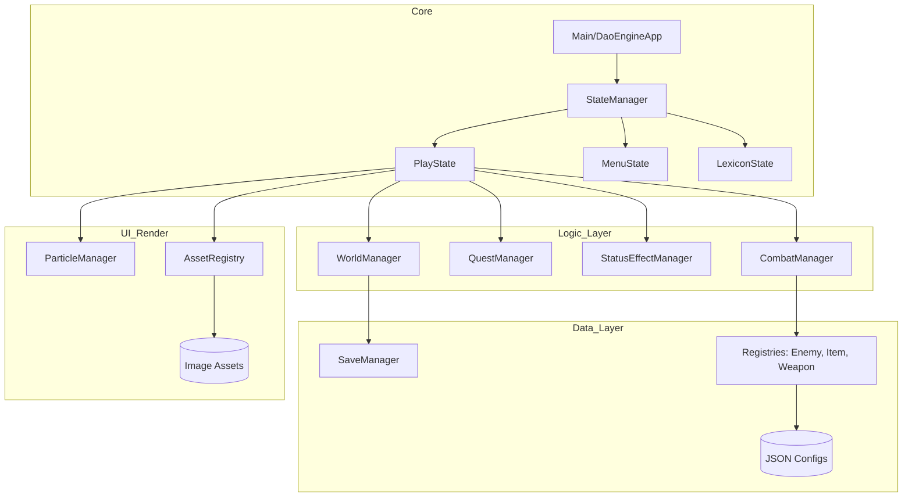

# 1. Návrh testovací strategie

## 1.1 Úvod a cíle dokumentu
Tento dokument definuje komplexní testovací strategii pro projekt **DaoEngine**. Cílem je zajistit vysokou kvalitu herního enginu, minimalizovat rizika spojená s vývojem a poskytnout strukturovaný rámec pro ověřování funkčních i nefunkčních požadavků. Tato strategie slouží jako hlavní vodítko pro plánování, realizaci a vyhodnocování testovacích aktivit v rámci celého životního cyklu vývoje softwaru (SDLC).

## 1.2 Podrobný popis aplikace
**DaoEngine** je modulární 2D RPG engine postavený na platformě Java (JDK 21) s využitím knihovny JavaFX pro grafický výstup a zvuk. Engine implementuje principy "Data-Driven Designu", což umožňuje oddělit herní logiku od samotných dat (definovaných v JSON formátu).

### 1.2.1 Architektura systému
Aplikace je navržena podle vzoru State, který řídí hlavní tok programu. Jednotlivé komponenty komunikují přes centralizované manažery.

### 1.2.2 Klíčové moduly
1.  **State Management**: Přepínání mezi herními stavy, správa přechodových animací.
2.  **Entity System**: Kompozitní systém pro správu životů, pohybu a umělé inteligence (AI) entit.
3.  **Combat Engine**: Výpočty poškození na základě atributů, správa projektilů a kolizí.
4.  **Progression System**: Správa questů, zkušeností (XP), úrovní kultivace a inventáře.
5.  **Persistence**: Robustní systém pro ukládání a načítání stavu světa do binárních/JSON souborů.

## 1.3 Analýza rizik a prioritizace
V rámci testování byla provedena analýza rizik, která určuje zaměření testovacích kapacit. Riziko je definováno jako součin pravděpodobnosti (P) a dopadu (D) na stupnici 1-5.

| Identifikátor | Modul / Funkcionalita | Riziko (P×D) | Priorita | Strategie zmírnění |
| :--- | :--- | :--- | :--- | :--- |
| **R01** | Výpočty atributů a poškození | 2 × 5 = 10 | **Kritická** | Rozsáhlé Unit testy, hraniční hodnoty. |
| **R02** | Ukládání a načítání (Save/Load) | 1 × 5 = 5 | **Kritická** | Integrační testy, testy integrity souborů. |
| **R03** | Stavový automat Questů | 3 × 3 = 9 | **Vysoká** | Procesní testy, TDL 2 pokrytí. |
| **R04** | Validace JSON konfigurací | 4 × 2 = 8 | **Vysoká** | Automatizované testy registrů. |
| **R05** | Renderování a UI (JavaFX) | 2 × 2 = 4 | **Nízká** | Manuální exploratory testování. |
| **R06** | Audio systém | 3 × 1 = 3 | **Nízká** | Manuální ověření. |

## 1.4 Testovací úrovně (Test Levels)

### 1.4.1 Unit Testing (Jednotkové testy)
*   **Rozsah**: Nejnižší úroveň, testování atomických funkcí (metody tříd `AttributeSet`, `Quest`, `StatusEffect`).
*   **Vstupní kritéria**: Kód je zkompilovatelný bez chyb.
*   **Výstupní kritéria**: 100% úspěšnost definovaných testů, pokrytí všech netriviálních metod.
*   **Nástroje**: JUnit 5, Mockito (pro izolaci závislostí).

### 1.4.2 Integration Testing (Integrační testy)
*   **Rozsah**: Testování spolupráce mezi moduly (např. `CombatManager` + `LivingEntity`, `SaveManager` + `WorldState`).
*   **Vstupní kritéria**: Úspěšné Unit testy dotčených modulů.
*   **Výstupní kritéria**: Ověření správného předávání dat mezi rozhraními.
*   **Nástroje**: JUnit 5.

### 1.4.3 System Testing (Systémové testy)
*   **Rozsah**: Ověření aplikace jako celku. Testování end-to-end scénářů (např. spuštění nové hry -> splnění questu -> uložení).
*   **Vstupní kritéria**: Stabilní build, dokončené integrační testy.
*   **Výstupní kritéria**: Aplikace splňuje definované uživatelské scénáře.
*   **Nástroje**: Manuální testování dle scénářů, JavaFX TestFX (pokud by byla nutná automatizace UI).

## 1.5 Testovací proces (STLC)
Pro projekt je adaptován Software Testing Life Cycle (STLC):
1.  **Analýza požadavků**: Identifikace testovatelných částí z technické specifikace.
2.  **Plánování**: Definice rozsahu (v tomto dokumentu).
3.  **Návrh testů**: Vytvoření testovacích případů a scénářů (viz `test_scenarios.md`).
4.  **Příprava prostředí**: Nastavení testovacích dat (např. mockované JSON soubory).
5.  **Provedení**: Běh automatizovaných testů přes Maven a manuální exekuce.
6.  **Ukončení**: Vyhodnocení výsledků a reportování.

## 1.6 Správa defektů (Defect Lifecycle)
Každý nalezený defekt musí projít následujícím životním cyklem:
- **New**: Defekt nahlášen.
- **Assigned**: Přidělen vývojáři k opravě.
- **Fixed**: Opraven v kódu.
- **Retest**: Verifikace opravy testerem.
- **Closed / Reopened**: Defekt je definitivně vyřešen nebo se vrací k opravě.

## 1.7 Testovací prostředí a nástroje
*   **OS**: Windows 10/11, macOS, Linux (Java cross-platform).
*   **Runtime**: Java Development Kit (JDK) 21+.
*   **Build Tool**: Apache Maven 3.9+.
*   **Frameworky**:
    - **JUnit 5 (Jupiter)**: Hlavní testovací runner.
    - **Mockito**: Pro vytváření mock objektů a stubbing.
    - **Jackson**: Pro ověřování serializace dat.
    - **Mermaid.js**: Pro vizualizaci procesů a architektury.

## 1.8 Akceptační kritéria
Projekt bude považován za otestovaný, pokud:
1.  Všechny automatizované testy (min. 5 unit a 4 integrační) projdou.
2.  Jsou pokryty všechny kritické scénáře popsané v analýze rizik.
3.  Nebyl nalezen žádný defekt úrovně "Blocker" nebo "Critical".

